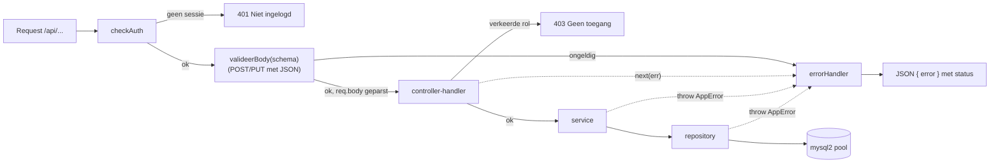
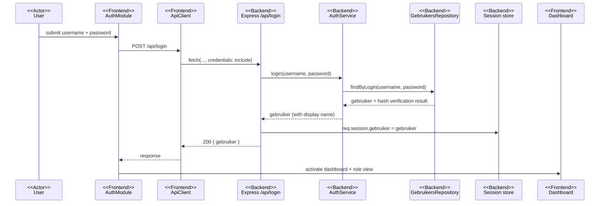
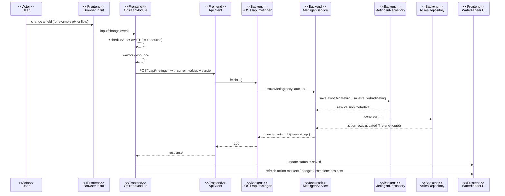
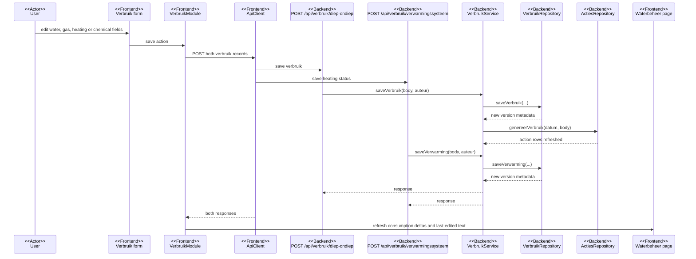
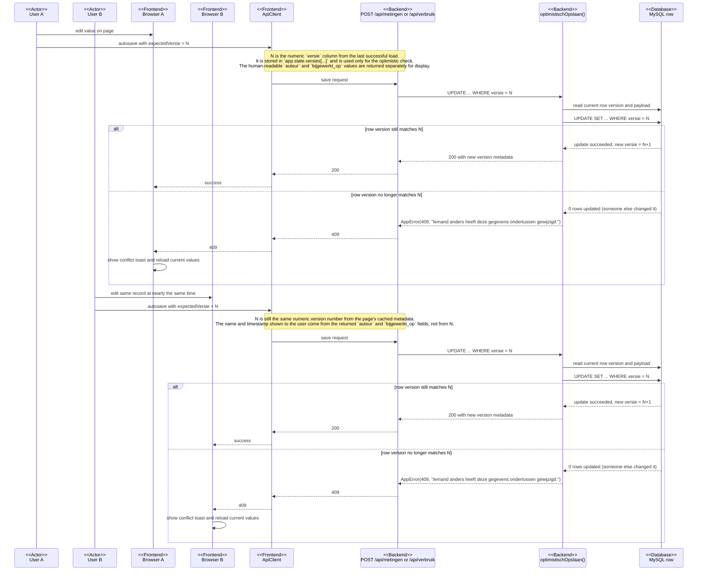
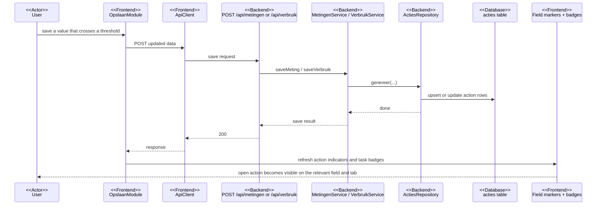
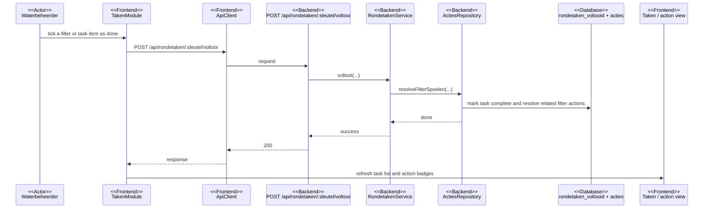
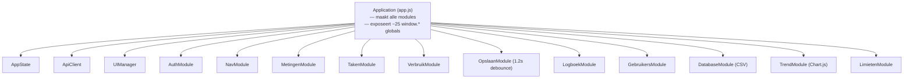
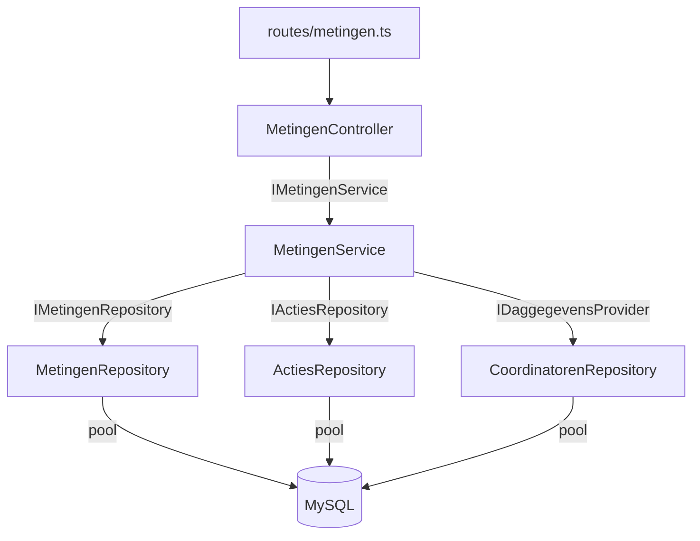

# Element Design Specification (EDS)

**Document ID:** EDS-DDZ-0.4
**Element:** Digitale Dagstaat Zwembad — full web application
**Version:** 0.4
**Status:** DRAFT
**Date:** 2026-06-23
**Author:** P. Heijmans
**Approver:**
**Parent EPS:** EPS-DDZ-0.5

> This EDS records _how_ the application is designed to satisfy the requirements in
> EPS-DDZ-0.4. It is descriptive of the current implementation (not aspirational):
> where the design has known gaps relative to the EPS, they are recorded as design
> decisions and risks rather than hidden. Requirement IDs referenced here (AUTH-,
> GEN-, WB-, CO-, ACT-, LIM-, ADM-, TRD-) are defined in the parent EPS.

---

## Revision History

| Version | Date       | Author      | Description                                                                                                                                                                                                                                                                                                                                                                                    |
| ------- | ---------- | ----------- | ---------------------------------------------------------------------------------------------------------------------------------------------------------------------------------------------------------------------------------------------------------------------------------------------------------------------------------------------------------------------------------------------- |
| 0.1     | 2026-06-03 | P. Heijmans | Initial design specification                                                                                                                                                                                                                                                                                                                                                                   |
| 0.2     | 2026-06-11 | P. Heijmans | New domains actieteksten + dienst (repo/service/controller/route + modules); kathodische_bescherming column; auteur on checklist/daggegevens; 3-category Taken; toast + confirm/alert modal; idempotent plain-`ALTER` migrations for MySQL 8                                                                                                                                                   |
| 0.3     | 2026-06-16 | P. Heijmans | Generic `configuratie` store + Configuratie domain/screen (DD-019); configurable sliding session time-out (DD-005 revised) with live config + global 401→login UX; optimistic concurrency on waterbeheer meetwaarden/verbruik via shared `optimistischOpslaan` helper (DD-020); passive completeness indicators + version label (DD-021); `/api/versie` endpoint; added §5.5 sequence diagrams |
| 0.4     | 2026-06-23 | P. Heijmans | §5.4 now cross-references the new **EPS Appendix A — Input Value Catalogue** (per-field definition, unit, decimal precision and default min/max) and notes the schema `DECIMAL` precision is the authoritative fraction; parent EPS → 0.5                                                                                                                                          |

---

## 1. Introduction

### 1.1 Purpose

To document the architecture, design decisions, interfaces, data model and UI of
the Digitale Dagstaat Zwembad, so that the implementation is understandable,
maintainable and verifiable against the EPS, and so that future changes (including
AI-assisted ones) follow the established patterns.

### 1.2 Scope

Covers the full application: client-side (browser UI), server-side (API), the
relational data model, cross-cutting concerns (auth, validation, error handling,
autosave, action generation), deployment, and the test strategy. Excludes
sensor/PLC integration and any out-of-scope items listed in the EPS §1.2.

### 1.3 Definitions & Acronyms

| Term          | Definition                                                                         |
| ------------- | ---------------------------------------------------------------------------------- |
| DI            | Dependency Injection                                                               |
| ISP           | Interface Segregation Principle                                                    |
| SPA-like      | Single HTML page whose sections are toggled client-side (no client router/bundler) |
| MPA           | Multi-Page Application                                                             |
| Repository    | Class encapsulating all SQL for one domain                                         |
| Service       | Class holding business logic for one domain                                        |
| Controller    | Express request handler for one domain (HTTP concerns only)                        |
| Route factory | `maakXxxRouter(pool)` that wires repo→service→controller→Router                    |
| Upsert        | `INSERT … ON DUPLICATE KEY UPDATE` (idempotent write)                              |
| Autosave      | Debounced background save of edited fields                                         |

Plus all domain terms from EPS §1.3 (Diep, Ondiep, Peuterbad, gebonden chloor,
spoelbeurt, etc.).

### 1.4 Reference Documents

| ID      | Title                                                                                     | Version |
| ------- | ----------------------------------------------------------------------------------------- | ------- |
| EPS-DDZ | Element Performance Specification                                                         | 0.5     |
| —       | `docs/architecture.md` + `docs/architecture/{backend,frontend,flows,database,testing}.md` | current |
| —       | `CLAUDE.md` — project conventions                                                         | current |
| —       | `init.sql` — authoritative schema                                                         | current |

---

## 2. Design Overview

### 2.1 Design Philosophy & Approach

- **Simplicity over machinery.** A small operator tool maintained by a solo,
  AI-assisted developer. Favour readable code and conventions over heavyweight
  frameworks; no client bundler, no ORM, no migration tool.
- **Layered backend with strict dependency inversion.** Every domain follows
  route-factory → controller → service → repository; upper layers depend only on
  interfaces, so each layer is unit-testable by mocking the layer below.
- **Convention-driven uniformity.** Each of the nine domains looks the same, so a
  new domain is added by copying the pattern.
- **Idempotent, date-keyed data.** One record per day per domain; writes are
  upserts; the schema is created idempotently at startup.
- **Continuous feedback.** Edits autosave with visible status; threshold breaches
  surface immediately as grouped, resolvable actions.
- **Dutch domain language** throughout code, UI and database labels.

### 2.2 Key Design Decisions Summary

| ID     | Decision                                                                                                                                                                                                                  | Section          |
| ------ | ------------------------------------------------------------------------------------------------------------------------------------------------------------------------------------------------------------------------- | ---------------- |
| DD-001 | Layered OO backend with DI (route-factory → controller → service → repository)                                                                                                                                            | §3, §7           |
| DD-002 | Upper layers depend on interfaces; concretes wired only in route factory; ISP via `IDaggegevensProvider`                                                                                                                  | §3, §7           |
| DD-003 | Frontend is vanilla ES6 classes, no bundler/build step                                                                                                                                                                    | §3, §6           |
| DD-004 | Single `Application` container + minimal `window.*` globals for `onclick`                                                                                                                                                 | §6               |
| DD-005 | Session-based authentication (`express-session`); sliding/idle `rolling` cookie whose max-age comes from the live configuration (default 5 min)                                                                           | §5.2             |
| DD-006 | MySQL with idempotent `init.sql` at startup; no migration tool                                                                                                                                                            | §7.3             |
| DD-007 | Runtime validation with Zod via `valideerBody` middleware                                                                                                                                                                 | §7.4             |
| DD-008 | Central `errorHandler` + `AppError(message, status)`                                                                                                                                                                      | §7.5             |
| DD-009 | Action generation is fire-and-forget (no transaction with the save)                                                                                                                                                       | §3, §7           |
| DD-010 | Dagstaat edits autosave on a 1.2 s debounce (no manual save button)                                                                                                                                                       | §4.5, §6         |
| DD-011 | CSV export/import is semicolon-delimited (EU-Excel)                                                                                                                                                                       | §5.1             |
| DD-012 | Single shared `mysql2` connection pool injected everywhere                                                                                                                                                                | §7.1             |
| DD-013 | `maakApp(pool)` separated from `server.ts` for Supertest mounting                                                                                                                                                         | §7.1             |
| DD-014 | Each backwash reason is its own action row; the frontend groups them per bath                                                                                                                                             | §3, §4           |
| DD-015 | Frontend classes carry `module.exports` guards; tested with Jest + jsdom                                                                                                                                                  | §9.3             |
| DD-016 | Combined chlorine and consumption deltas are derived, not stored                                                                                                                                                          | §5.4             |
| DD-017 | Session secret required in production (`SESSION_SECRET`); fail fast if unset, dev/test fallback only                                                                                                                      | §5.2, §8.2       |
| DD-018 | Password hashing with Node's built-in scrypt (no external dependency); legacy plaintext upgraded on login + startup migration                                                                                             | §5.2, §7.2       |
| DD-019 | Generic `configuratie` key/value table + a single shared `ConfiguratieService` (in-memory cache) feeding both the session middleware and the admin router                                                                 | §3.1, §5.2, §7.3 |
| DD-020 | Optimistic concurrency on the waterbeheer meetwaarden/verbruik tables via a shared `optimistischOpslaan()` helper (conditional UPDATE on `versie`, `AppError(409)` on mismatch); `auteur`/`bijgewerkt_op` for attribution | §3.1, §5.4, §7.3 |
| DD-021 | Passive completeness indicators (subtab/page-tab dot) replace the post-save warning; app-version label from `/api/versie`; global 401 handler returns the UI to the login screen                                          | §4.2, §5.1, §6.2 |

### 2.3 Architecture Overview

```
┌─────────────────────────────────────────────────────────────┐
│ Browser client — one HTML page, vanilla ES6 modules          │
│  AppState · ApiClient · UIManager · Auth · Nav · Metingen ·  │
│  Verbruik · Opslaan · Logboek · Gebruikers · Database ·      │
│  Trend (Chart.js) · Limieten                                 │
└───────────────────────────────┬─────────────────────────────┘
                                │ HTTP(S) · JSON · session cookie
┌───────────────────────────────▼─────────────────────────────┐
│ Express app (maakApp(pool))                                  │
│  express.json → session → [domain routers] → frontend → static│
│  per route: checkAuth → valideerBody(schema) → controller    │
│             controller → service → repository                │
│  errorHandler (last)                                         │
└───────────────────────────────┬─────────────────────────────┘
                                │ SQL via shared mysql2 pool
                        ┌────────▼────────┐
                        │   MySQL 8        │  init.sql (idempotent)
                        └─────────────────┘
```

#### Request lifecycle



---

## 3. Design Decisions

### 3.1 Decision Log

| ID     | Decision                                                                                                                                                                                                                                   | Rationale                                                                                                                        | Alternatives                                                        | Trade-offs                                                                                           |
| ------ | ------------------------------------------------------------------------------------------------------------------------------------------------------------------------------------------------------------------------------------------ | -------------------------------------------------------------------------------------------------------------------------------- | ------------------------------------------------------------------- | ---------------------------------------------------------------------------------------------------- |
| DD-001 | Layered OO + DI per domain                                                                                                                                                                                                                 | Testability, uniform structure, clear separation                                                                                 | Single-file handlers; framework (NestJS)                            | More files/boilerplate per domain                                                                    |
| DD-002 | Depend on interfaces; wire concretes in route factory; ISP                                                                                                                                                                                 | Each layer mockable; minimal coupling (`IDaggegevensProvider`)                                                                   | Concrete deps; service locator                                      | Extra interface files                                                                                |
| DD-003 | Vanilla ES6 frontend, no bundler                                                                                                                                                                                                           | Runs behind any static server/proxy; no build pipeline; low complexity for solo dev                                              | React/Vue + Vite                                                    | No components/JSX; manual DOM; no tree-shaking                                                       |
| DD-004 | `Application` container + few `window.*` globals                                                                                                                                                                                           | Single wiring point; inline `onclick` handlers still work                                                                        | Full module system; event delegation only                           | Globals are a small surface to manage                                                                |
| DD-005 | Session auth; sliding/idle `rolling` cookie, max-age from live config (default 5 min)                                                                                                                                                      | Simple, server-controlled; idle-out limits unattended access; tunable without restart                                            | JWT; OAuth; fixed absolute lifetime                                 | Server holds session state (fine at this scale); short idle-out needs graceful 401 handling (DD-021) |
| DD-006 | Idempotent `init.sql` at startup (plain `ALTER … ADD/DROP COLUMN`, errors swallowed per statement)                                                                                                                                         | Zero-friction schema bootstrap; no migration tooling to maintain; works on MySQL 8 (no MariaDB-only `IF NOT EXISTS`)             | Knex/Prisma migrations                                              | No ordered migration history; harmless `Duplicate column` warnings when already applied              |
| DD-007 | Zod `valideerBody`; `looseObject` for measurement domains                                                                                                                                                                                  | Runtime safety at the edge; lenient where the UI mixes strings/numbers                                                           | Manual checks; strict schemas everywhere                            | `looseObject` lets unknown fields through by design                                                  |
| DD-008 | `AppError` + central `errorHandler`                                                                                                                                                                                                        | Consistent error→status mapping; logs only 5xx                                                                                   | Per-handler try/catch responses                                     | Must remember to `next(err)`/throw                                                                   |
| DD-009 | Fire-and-forget action generation                                                                                                                                                                                                          | Keeps the save fast; action is derived state                                                                                     | Transactional save+generate                                         | No atomic guarantee; recomputed on next save                                                         |
| DD-010 | Autosave 1.2 s debounce                                                                                                                                                                                                                    | No "save" button; fewer lost edits                                                                                               | Explicit save; per-field save                                       | Many small writes; brief unsaved window                                                              |
| DD-011 | Semicolon CSV                                                                                                                                                                                                                              | Opens directly in EU-locale Excel                                                                                                | Comma CSV; XLSX                                                     | Non-standard delimiter                                                                               |
| DD-012 | One shared pool injected                                                                                                                                                                                                                   | Connection reuse; single config point                                                                                            | Per-request connections                                             | Shared resource to size correctly                                                                    |
| DD-013 | `maakApp(pool)` vs `server.ts`                                                                                                                                                                                                             | App can be mounted by Supertest without listening                                                                                | App built in server.ts                                              | Slight indirection                                                                                   |
| DD-014 | Per-reason action rows, grouped client-side                                                                                                                                                                                                | Backend stays simple (one row per `actie_type`); UI shows one card per bath                                                      | Merge reasons server-side                                           | Grouping logic lives in the client                                                                   |
| DD-015 | `module.exports` guards + jsdom tests                                                                                                                                                                                                      | Frontend classes become unit-testable without a bundler                                                                          | No frontend tests; Cypress only                                     | A guard line per file; script-mode `export {}` in tests                                              |
| DD-016 | Combined chlorine & deltas derived                                                                                                                                                                                                         | Single source of truth; no stored duplication to keep consistent                                                                 | Persist computed columns                                            | Recomputed on read                                                                                   |
| DD-017 | Require `SESSION_SECRET` in production via `bepaalSessionSecret()` (fail fast under `NODE_ENV=production`); dev/test use a labelled fallback                                                                                               | No insecure default reaches production; dev/tests keep working without config                                                    | Always require (breaks dev); keep insecure default (rejected)       | Relies on `NODE_ENV=production` being set in the deployment                                          |
| DD-018 | Hash passwords with Node's built-in `crypto.scrypt` (format `scrypt$N$salt$hash`); verify supports legacy plaintext; upgrade on login + a startup migration                                                                                | Zero new dependency (works on Alpine; avoids the container `node_modules` gotcha); secure KDF; smooth migration of existing rows | bcrypt/argon2 (native build on Alpine); accept plaintext (rejected) | Hand-rolled format string; scrypt cost fixed at N=16384                                              |
| DD-019 | Generic `configuratie` (sleutel/waarde/type) + one shared `ConfiguratieService` with an in-memory cache; the same instance feeds the session middleware (per-request max-age) and the `/api/configuratie` router                           | Add settings without schema changes; no DB hit per request; admin edits take effect immediately (same cache)                     | Per-setting columns/endpoints; env-only config (needs restart)      | Service instance shared, not pool-injected like other domains (documented exception)                 |
| DD-020 | Optimistic concurrency via `optimistischOpslaan()`: conditional `UPDATE … WHERE key AND versie = ?` (row-lock serialises writers), new-record/conflict/duplicate-insert handling, `AppError(409)` on mismatch; client round-trips `versie` | Turns silent lost-updates into a visible, recoverable conflict; cheap; reuses the layered pattern                                | Pessimistic locks; CRDT/real-time merge; field-level PATCH          | Conflict reload discards the user's just-typed value (accepted; autosave makes the window tiny)      |
| DD-021 | Passive completeness dot (subtab/page-tab) instead of a post-save warning; `/api/versie` header label; global 401 → login screen with explanation                                                                                          | Less nagging; clearer "what's incomplete"; short idle-out needs a graceful re-login path; version aids support                   | Keep transient warning; per-tab modal on expiry                     | Extra client state (per-record version + completeness)                                               |

### 3.2 Decision Narratives (selected)

#### DD-001 / DD-002: Layered backend with dependency inversion

**Decision.** Each domain (auth, gebruikers, limieten, metingen, coordinatoren,
verbruik, trend, database, logboek) is implemented as `route-factory → controller →
service → repository`. Controllers depend on a service **interface**
(`IXxxService`); services depend on repository **interfaces**; concrete classes are
instantiated only inside the route factory.

**Rationale.** Every layer can be unit-tested by mocking the layer beneath
(controller mocks service, service mocks repositories, repository mocks the pool).
The `MetingenService` consumes a narrow `IDaggegevensProvider` (only
`getDaggegevens`) implemented by `CoordinatorenRepository` — Interface Segregation,
so the service sees only what it needs.

**Alternatives.** Single-file route handlers (rejected: poor testability/uniformity)
or a DI framework like NestJS (rejected: too much machinery for the size).

**Trade-offs.** More files and interfaces per domain, accepted for the testability
and consistency payoff.

#### DD-003 / DD-004: Vanilla-JS frontend with an Application container

**Decision.** The browser code is plain ES6 classes loaded as sequential
`<script>` tags. A single `Application` instance owns all module singletons; each
module receives `app` and calls peers via `this.app.<module>.<method>()`. Only the
~25 functions needed by inline `onclick` handlers are exposed on `window`.

**Rationale.** No build step means the app can be served by any static server or
reverse proxy; the container gives one explicit wiring point and avoids global
sprawl. Cross-module calls are explicit and traceable.

**Trade-offs.** No component model, JSX or tree-shaking; DOM is manipulated
directly. Accepted given the app's modest UI and the solo-developer constraint.

#### DD-009 / DD-014: Action generation and grouping

**Decision.** After a measurement/consumption/coordinator save, the relevant
`ActiesRepository.genereer*` method runs **fire-and-forget** and writes one row per
`(bad_id, datum, actie_type)` (upsert if active, delete-if-unresolved if not).
`TakenService` then composes these actions with the rondetaken catalogue
**server-side**: all `filter_spoelen_*` actions for a bath fold onto that bath's
filter rondetaak (one row carrying every reason), the rest become standalone alarm
rows. Ticking the filter rondetaak resolves those actions
(`resolveFilterSpoelen`). A filter rondetaak that has _ever_ triggered an alarm
today (open **or** already resolved) is categorised **Verplicht**, so it stays in
the must-do section after it is ticked off — struck-through and keeping its reason —
rather than dropping back to Belangrijk/Overig.

**Rationale.** Keeps saves fast and the backend simple (no cross-table
transaction), while the user still sees a single "Filter spoelen" action per bath
with all its reasons. Actions are derived state and are recomputed on the next save
or coordinator-block delete (ACT-005).

**Trade-offs.** No atomic guarantee between the save and the generated action; a
crash between the two would be reconciled on the next save. Acceptable for this
domain.

---

## 4. UI/UX Design

### 4.1 UI Architecture

| Item              | Choice                                                                                | Rationale                      |
| ----------------- | ------------------------------------------------------------------------------------- | ------------------------------ |
| Rendering model   | Server-assembled single HTML page; client-side section toggling (SPA-like, no router) | No build step; simple delivery |
| UI "framework"    | Vanilla ES6 classes                                                                   | DD-003                         |
| Component library | None — hand-written HTML partials + CSS                                               | Simplicity                     |
| CSS approach      | Single stylesheet (`frontend/css/style.css`), semantic class names                    | No tooling needed              |
| Charts            | Chart.js (client library)                                                             | Trend visualisation (TRD-001)  |

### 4.2 Design System & Component Library

- **Visual language:** functional admin/data-entry styling; blue accent
  (`#0056b3`) for section headers, green/amber/red for save and action states.
- **Reusable patterns (CSS classes, not components):** `categorie-box` (card),
  `categorie-tabel` (data table), `subtab-nav` / `subtab-btn`, `btn-centraal-opslaan`
  (primary), `btn-wissen-gevaar` (destructive), `actie-indicator` (⚠/✓ field marker),
  `tab-actie-indicator` (⚠ tab badge), `tab-onvolledig-indicator` (subdued ● "fields
  incomplete" dot, DD-021), `laatst-gewijzigd` ("last edited by …" line, DD-020),
  `status-melding` (toast), autosave-status text.
- **Status colours:** pending `#888`, saving `#fd7e14`, saved `#28a745`, error
  `#dc3545`. (The former post-save "warning" status is replaced by the passive
  completeness dot, DD-021.)
- **Typography/spacing:** browser-default sans stack; spacing via the stylesheet.

### 4.3 Screen Designs

The app is one page; "screens" are sections shown/hidden by the role navigation and
tab/subtab state. All are gated by login (UI-001).

#### Login (UI-001)

**Purpose:** authenticate. **Elements:** login name, password, submit, error line.

```
┌───────────────────────────┐
│        Inloggen Dagstaat   │
│  [ Inlognaam            ]  │
│  [ Wachtwoord          ]  │
│  [        Inloggen      ]  │
└───────────────────────────┘
```

#### Header + role nav (all authenticated screens)

Header shows the logged-in user's name with role abbreviation, e.g. `Paul (WB)`,
as a clickable **menu** (currently: Uitloggen). When several users share a first
name the display name is made unique with the surname initial (`Paul H`), or the
full surname if that initial also collides (`Paul Heijmans` vs `Paul Hermans`),
computed once at login in `AuthService` (`weergavenaam`). A small **app-version
label** (`v… (commit)`, from `/api/versie`) sits next to the title. Role nav:
Waterbeheer · Coördinatoren · Limieten · Actie-teksten · Gebruikers Beheer ·
Database Beheer · Configuratie · Trendanalyse (shown per role). A central date
picker drives all dagstaat data.

```
┌──────────────────────────────────────────────────────────┐
│ Zwembad Dagstaat                      <welkom>  [Uitloggen]│
├──────────────────────────────────────────────────────────┤
│ [Waterbeheer][Coördinatoren][Limieten][Gebruikers][DB][Trend]│
│ Datum: [ 2026-06-03 ]                                      │
└──────────────────────────────────────────────────────────┘
```

#### Waterbeheer → Diep/Ondiep (UI-002)

Tabs: Meetwaarden · Verbruik · Verwarmingssysteem · Bezoekers · Taken; plus the
page-level tabs Diep/Ondiep · Peuterbad · Logboek. A compact **"Dienst vandaag"**
chip under the date selector records the two-person duty (WB-009).

- **Meetwaarden:** per bath (Diep, Ondiep) pH, chloor, temp, flow, filterdruk in/out,
  kathodische bescherming (responsive grid: parameters as rows on mobile, transposed
  to columns ≥900px).
- **Verbruik:** water (diep/ondiep/totaal), electricity (night/day), gas, flocculant,
  chemicals; each with a read-only daily-consumption (today − previous) cell.
- **Verwarmingssysteem:** status/inspection checkboxes.
- **Bezoekers:** today's count and cumulative-since-backwash (from coordinator data).
  Action `⚠`/`✓` markers attach to the relevant inputs; a ⚠ badge appears on the
  page tab, the Taken subtab and the subtab that holds a field with an open action.
  A subdued ● dot marks a subtab/page tab whose fields are still incomplete (DD-021),
  and a "Laatst gewijzigd door … om …" line shows who last saved (DD-020).

#### Waterbeheer → Peuterbad (UI-003)

Subtabs Meetwaarden (pH, chloor, filterdruk, flow), Verbruik (water, chemicals
chloor/zwavelzuur, each with consumption cell) and Taken.

#### Waterbeheer → Logboek (UI-004) / Coördinatoren → Logboek (UI-009)

Timestamped free-text entries for the day; add and delete.

#### Waterbeheer → Taken (UI-005)

Each bath page (Diep/Ondiep, Peuterbad) has a **Taken** subtab split into three
sections: **Verplicht** (triggered alarms), **Belangrijk** (critical rondetaken —
regelaars, spraypark filters, douches-test) and **Overig** (remaining optional
rondetaken). Each row: Gebied · Taak · Reden · Uitgevoerd (checkbox); done rows
struck-through with who/when. `filter_spoelen_*` alarms fold onto the bath's filter
row (one row, with the reason); ticking it also clears those actions. A row that was
triggered as **Verplicht** stays in that section once ticked off (done, reason kept),
so it remains clear that and why it was required. Facility-wide chemical alarms group
under **Algemeen**. The ⚠ badge fires for open **Verplicht** items only. There is no
separate global Acties tab.

```
┌ Verplicht vandaag (n) ──────────────────────────────────┐
│ Gebied   │ Taak             │ Reden          │ Uitgevoerd │
│ Diep     │ Diep filter ger… │ Flow < …       │  [ ]       │
│ Spraypark│ Filters spraypa… │                │  [ ]       │
└─────────────────────────────────────────────────────────┘
```

#### Coördinatoren → Metingen (UI-006)

One block per timeslot; each block a table with a row per bath: pH, chloor vrij,
chloor totaal, **gebonden** (read-only = totaal − vrij), watertemp, and clarity
(large baths) or "Gebruikt" checkbox (Peuterbad). "+ Nieuw blok toevoegen".

#### Coördinatoren → Checklist (UI-007) / Daggegevens (UI-008)

Checklist: test-run checkboxes. Daggegevens: air temperature, visitors today,
visitors since backwash.

#### Limieten (UI-010)

Grouped tables (Diep/Ondiep meetwaarden, Peuterbad meetwaarden, Verbruik,
Coördinatoren-chloor, Actie-drempelwaarden, Seizoen). Min/max per parameter (or a
single threshold/date for the single-value groups). Autosave; "restore defaults".

#### Actie-teksten (UI-010b)

Administrator-only table of the editable action-text templates: per action a label,
the `sjabloon` (with `{bad}`/`{drempel}`/`{waarde}` placeholders) and a live preview
of the rendered text. Autosave; "Standaardteksten" restores the built-in defaults.

#### Gebruikers Beheer (UI-011)

Table of accounts (voornaam, achternaam, inlognaam, wachtwoord, taak) with inline
add/edit/delete; per-row autosave status.

#### Database Beheer (UI-012)

Per-table rows: CSV export, CSV import, clear; grouped by area. A red "danger zone"
with full delete and recreate-with-defaults (double confirmation, logout after).

#### Trendanalyse (UI-013)

From/To date pickers; tabs Meetwaarden / Verbruik; grids of Chart.js canvases per
parameter for both bath groups.

#### Configuratie (UI-014)

Administrator-only table of generic settings (label + value input per row), e.g.
the session idle time-out in minutes. Autosave per value; the backend validates
(e.g. 1–1440) and changes apply without a restart (DD-019).

### 4.4 Routing Approach

No client-side router. The server serves one HTML page at `/`; `AuthModule` and
`NavModule` toggle the visible role section and tab/subtab via DOM `display` and
state. Deep-linking to a screen is not supported (by design). Authentication is
enforced server-side per API call, not via route guards.

| "Route" (state) | Module                 | Auth                                 | Notes              |
| --------------- | ---------------------- | ------------------------------------ | ------------------ |
| `/` (page)      | FrontendController     | No (login shown until authenticated) | Assembles partials |
| Role section    | AuthModule.wisselRol   | Yes                                  | Shown per role     |
| Tab/subtab      | Metingen/Verbruik/etc. | Yes                                  | `display` toggling |

### 4.5 State Management

| State                                                                               | Approach                                                              | Rationale                                |
| ----------------------------------------------------------------------------------- | --------------------------------------------------------------------- | ---------------------------------------- |
| Shared UI state (active date, role, subtabs, active limits, logged-in user, timers) | `AppState` singleton on the container                                 | One source of truth; no framework needed |
| Server data                                                                         | Fetched on demand via `ApiClient`; not cached beyond the current view | Small data; always fresh                 |
| Form state                                                                          | Lives in the DOM inputs; read at save time                            | No form library                          |
| Autosave/save status                                                                | `OpslaanModule` timers + `UIManager.setAutoSaveStatus`                | DD-010                                   |
| Auth state                                                                          | Server session; client mirrors `ingelogdeGebruiker` in `AppState`     | DD-005                                   |

### 4.6 Responsive & Adaptive Strategy

Primarily desktop/tablet (on-site use). Tables and chart grids use flexible
widths/auto-fill grids; layout is functional rather than fully responsive. Mobile is
best-effort (EPS §5.4). No dedicated breakpoints are formally specified.

---

## 5. Interface Design

### 5.1 API Design

| Item         | Choice                                                   |
| ------------ | -------------------------------------------------------- |
| Style        | REST-ish JSON over HTTP, single origin                   |
| Base path    | `/api` (+ domain sub-paths)                              |
| Auth         | `express-session` cookie; `checkAuth` middleware         |
| Versioning   | None (single internal deployment)                        |
| Validation   | Zod via `valideerBody(schema)` on mutating routes        |
| Error format | `{ "error": "<message>" }` with `AppError.status` or 500 |
| CSV          | Semicolon-delimited export/import (DD-011)               |

#### Endpoint catalogue

| Router (factory)   | Mount                | Endpoints                                                                                                            | Role                                                           |
| ------------------ | -------------------- | -------------------------------------------------------------------------------------------------------------------- | -------------------------------------------------------------- |
| `auth.ts`          | `/api`               | `POST /login`, `POST /logout`, `GET /ingelogd`                                                                       | — / session                                                    |
| `metingen.ts`      | `/api`               | `GET/POST /metingen`, `GET /acties`, `POST /acties/:id/resolve`, `POST /acties/:id/unresolve`, `GET /bezoekers`      | waterbeheerder                                                 |
| `rondetaken.ts`    | `/api/rondetaken`    | `GET /`, `POST /:sleutel/voltooi`, `POST /:sleutel/heropen`                                                          | waterbeheerder                                                 |
| `taken.ts`         | `/api/taken`         | `GET /` — composed task list (rondetaken + acties) per bath page                                                     | waterbeheerder                                                 |
| `coordinatoren.ts` | `/api/coordinatoren` | `GET/POST /`, `DELETE /`, `GET/POST /checklist`, `GET/POST /daggegevens`, `GET/POST /logboek`, `DELETE /logboek/:id` | waterbeheerder or coördinator                                  |
| `verbruik.ts`      | `/api/verbruik`      | `GET/POST /diep-ondiep`, `GET /diep-ondiep/vorige`, `GET/POST /verwarmingssysteem`                                   | waterbeheerder                                                 |
| `limieten.ts`      | `/api/limieten`      | `GET /`, `GET /defaults`, `POST /`                                                                                   | read: authenticated (any role) · write: **Administrator only** |
| `actieteksten.ts`  | `/api/actieteksten`  | `GET /`, `GET /defaults`, `POST /`                                                                                   | read: authenticated · write: **Administrator only**            |
| `dienst.ts`        | `/api/dienst`        | `GET /`, `GET /waterbeheerders`, `POST /`                                                                            | read: authenticated · write: admin/waterbeheerder              |
| `logboek.ts`       | `/api/logboek`       | `GET /`, `POST /`, `DELETE /:id`                                                                                     | waterbeheerder                                                 |
| `gebruikers.ts`    | `/api/gebruikers`    | `GET /`, `POST /`, `PUT /:id`, `DELETE /:id`                                                                         | admin/waterbeheerder                                           |
| `database.ts`      | `/api/database`      | `POST /truncate/:tabel`, `POST /verwijder-alles`, `POST /initialiseer`, `GET /export/:tabel`, `POST /import/:tabel`  | admin/waterbeheerder                                           |
| `trend.ts`         | `/api/trend`         | `GET /metingen`, `GET /verbruik`                                                                                     | waterbeheerder                                                 |
| `configuratie.ts`  | `/api/configuratie`  | `GET /`, `PUT /:sleutel`                                                                                             | read: authenticated · write: **Administrator only**            |
| `versie.ts`        | `/api/versie`        | `GET /` — `{ versie, commit }` for the header label                                                                  | authenticated (public, non-sensitive)                          |
| `frontend.ts`      | `/`                  | `GET /` — assemble HTML partials                                                                                     | —                                                              |

> **Concurrency on saves.** `POST /api/metingen` and `POST /api/verbruik/{diep-ondiep,verwarmingssysteem}`
> accept an expected `versie` and return the new `{ versie, auteur, bijgewerkt_op }`;
> a version mismatch yields **409** (DD-020). GETs for those records include the
> same meta so the client can round-trip the version and show "last edited by".

> **Role policy (EPS R-006, resolved 2026-06-03).** Trend (`/api/trend/*`) is
> **Waterbeheerder only** (strict `isWaterbeheerder`; Administrators and Coördinators
> receive 403). Limieten reads (`GET /`, `/defaults`) require authentication and are
> allowed for **any role** (the dagstaat field-validation and season bounds depend on
> them); the Limieten management screen and writes (`POST /`) are **Administrator
> only** (`isAdmin`). The nav (`auth.js`) matches: the Limieten button is hidden from
> Waterbeheerder and the Trend button from Administrator.

### 5.2 Authentication & Session Model

- **Mechanism:** `express-session` with `secret = bepaalSessionSecret()`
  (`backend/config.ts`), `resave: false`, `saveUninitialized: false`, and a
  **sliding/idle** cookie: `rolling: true` re-issues the cookie on every response,
  and a small middleware after `session()` sets `req.session.cookie.maxAge` from the
  live `ConfiguratieService.getSessieTimeoutMs()` (default 5 min, key
  `sessie_timeout_minuten`). So the time-out resets on activity and is changeable
  without a restart (DD-019). `bepaalSessionSecret` returns `SESSION_SECRET` if set;
  under `NODE_ENV=production` it **throws if unset** (fail fast, no insecure default);
  in dev/test it falls back to a labelled value. (R-003 resolved.)
- **Expiry UX:** `ApiClient` treats a 401 (other than the login call) as an expired
  session and returns the UI to the login screen with a persistent
  "session expired due to inactivity" message (AUTH-007 / DD-021).
- **Login:** `POST /api/login` validates `{username, password}` (Zod), looks up the
  user, and stores `req.session.gebruiker` (typed via a `declare module
'express-session'` augmentation in `backend/types/index.ts`).
- **Authorisation:** `checkAuth` rejects sessionless requests (401); role helpers
  (`isWaterbeheerder`, `isWaterbeheerderOrCoordinator`, `isAdminOrWaterbeheerder`)
  gate handlers (403).
- **Logout:** `POST /api/logout` destroys the session. **Status:** `GET
/api/ingelogd` reports the current user for client bootstrap.
- **Password storage:** passwords are hashed with `crypto.scrypt` via
  `backend/wachtwoord.ts` (`hashWachtwoord`/`verifieerWachtwoord`/`isGehasht`).
  `findByLogin` fetches by login name and verifies in code (so per-row salts work);
  `getAll` never returns the hash; create/update/seed hash on write; legacy plaintext
  is upgraded on login and by a startup migration (`hashBestaandeWachtwoorden`).
  (R-002 resolved.) The session secret is now required in production (R-003 resolved;
  see §5.2 / `bepaalSessionSecret`).

### 5.3 Internal Interfaces

- **Client↔server:** `ApiClient.call(url, options)` (fetch with
  `credentials: 'include'`); JSON bodies; the session cookie carries identity.
- **Within the server:** controllers call service interfaces; services call
  repository interfaces; all repositories share the injected pool. The route
  factory is the only place concrete classes meet.

### 5.4 Data Structures & Formats

Representative shared types (`backend/types/index.ts`):

```typescript
interface Actie {
    id: number;
    bad_naam: string;
    beschrijving: string;
    actie_type: string;
    opgelost: boolean;
    opgelost_op: Date | null;
    opgelost_door: string | null;
}

interface Drempelwaarden {
    // action thresholds, loaded from LIMIETEN
    actie_druk_verschil: number;
    actie_druk_peuterbad: number;
    actie_flow_diep: number;
    actie_flow_ondiep: number;
    actie_flow_peuterbad: number;
    actie_chloor_min: number;
    actie_zwavelzuur_min: number;
    actie_bezoekers_max: number;
    actie_spoelbeurt_max: number;
    actie_spoelbeurt_dagen: number;
    actie_floculant_min: number;
    actie_gebonden_chloor_max: number;
    actie_chloor_peuterbad_min: number;
    actie_zwavelzuur_peuterbad_min: number;
}

// express-session augmentation keeps req.session.gebruiker typed at runtime
declare module 'express-session' {
    interface SessionData {
        gebruiker?: Gebruiker;
    }
}
```

**Derived (not stored):** combined chlorine = `chloor_totaal − chloor_vrij`
(computed in the coordinator UI and in `genereerCoordinatoren`); daily consumption =
today − previous day (computed in `VerbruikModule`). Decimal input is normalised
comma→point client-side before sending.

**Input value catalogue.** The full per-field catalogue — definition, unit, decimal
precision (fraction) and default valid range (min/max) for every input value — lives
in **EPS Appendix A**. The decimal precision there is realised by the column types in
this design: measurement decimals are `DECIMAL(4,2)` (pH, chlorine, filter pressure,
cathodic protection — 2 places) or `DECIMAL(_,1)` (temperatures — 1 place); meter and
stock/visitor counts are `INT` (0 places); the limit columns are `DECIMAL(10,2)`
(`LIMIETEN`). The schema is the authoritative source for the fraction; the default
min/max come from `LimietenRepository.DEFAULT_LIMIETEN` (seeded into `LIMIETEN`).

### 5.5 Sequence diagrams

The diagrams below describe the currently implemented day-to-day flows in the
client/server code. They focus on login, autosave, conflict handling, action
triggering, and the Waterbeheer pages that users operate most.

#### 5.5.1 Login and role activation



#### 5.5.2 Waterbeheer autosave on the measurement page



#### 5.5.3 Waterbeheer verbruik/verwarming save path



#### 5.5.4 Concurrent edit conflict on the same Waterbeheer page



#### 5.5.5 Threshold breach generates an action and marks the page



#### 5.5.6 Resolving a filter action from the Taken page



---

## 6. Client-side Architecture

### 6.1 Framework & Build Toolchain

| Item                  | Choice                                      | Rationale               |
| --------------------- | ------------------------------------------- | ----------------------- |
| Framework             | None (vanilla ES6 classes)                  | DD-003                  |
| Build tool            | None (no bundler/transpile for the browser) | Served as-is            |
| Package manager       | npm (dev/test tooling only)                 | —                       |
| TypeScript (frontend) | No                                          | Frontend stays plain JS |
| Charts                | Chart.js                                    | TRD-001                 |

### 6.2 Module & Directory Structure

```
frontend/
├── partials/        # HTML fragments assembled by FrontendController
│   ├── head, nav, dagstaat, limieten, actieteksten, gebruikers, database,
│   ├── configuratie, trendanalyse, login, footer
├── css/style.css
└── js/              # ES6 class modules, loaded sequentially
    ├── state.js     (AppState)        ├── api.js      (ApiClient)
    ├── ui.js        (UIManager)       ├── auth.js     (AuthModule)
    ├── nav.js       (NavModule)       ├── metingen.js (MetingenModule)
    ├── taken.js     (TakenModule)     ├── verbruik.js (VerbruikModule)
    ├── opslaan.js   (OpslaanModule)
    ├── logboek.js   ├── gebruikers.js ├── database.js
    ├── trend.js     ├── limieten.js   └── app.js      (Application + window.*)
```

Container/DI diagram:



| Module               | Responsibility                                                                                                                                                                                    |
| -------------------- | ------------------------------------------------------------------------------------------------------------------------------------------------------------------------------------------------- |
| `AppState`           | Single source of truth for shared state and timers                                                                                                                                                |
| `ApiClient`          | `fetch` wrapper (credentials); `parseNumberValue` (comma→point, empty→null)                                                                                                                       |
| `UIManager`          | Floating toast messages, the confirm/info **modal** (`bevestig`/`meld`, replacing `window.confirm`/`alert`), field validation against limits, autosave-status indicator                           |
| `NavModule`          | Date navigation bounded by the season window                                                                                                                                                      |
| `AuthModule`         | Login/logout, activate dashboard, switch role                                                                                                                                                     |
| `MetingenModule`     | Load/render measurements; ⚠/✓ field markers from open/resolved actions; coordinator blocks                                                                                                        |
| `TakenModule`        | Per-bath Taken subtab composed from `/api/taken`, in three categories (Verplicht / Belangrijk / Overig); toggle via rondetaken/acties endpoints; ⚠ tab/subtab badge for open Verplicht items only |
| `VerbruikModule`     | Load/save consumption & heating; `berekenVerbruik` deltas (Diep/Ondiep + Peuterbad)                                                                                                               |
| `OpslaanModule`      | All autosave orchestration (central + per block); `peuterbadOnvolledig`                                                                                                                           |
| `LogboekModule`      | Log entries for water-management and coordinators                                                                                                                                                 |
| `GebruikersModule`   | User management with per-row autosave                                                                                                                                                             |
| `DatabaseModule`     | CSV import/export, truncate, reinitialise                                                                                                                                                         |
| `TrendModule`        | Chart.js charts for measurements and consumption                                                                                                                                                  |
| `LimietenModule`     | Load/render/save limits (autosave); date conversions; `_normaliseer`                                                                                                                              |
| `ActieTekstenModule` | Load/render/save the action-text templates (autosave) with a live placeholder preview (Administrator)                                                                                             |
| `DienstModule`       | Waterbeheer-dienst chip: load/save the duty pair (datalist of water managers + free text); pre-fills the logged-in user                                                                           |
| `ConfiguratieModule` | Configuratie screen: load/render the generic settings and autosave each value (`PUT /api/configuratie/:sleutel`); Administrator-only                                                              |

Cross-cutting client behaviour added in 0.3: `OpslaanModule`/`MetingenModule`/
`VerbruikModule` track a per-record `versie` in `AppState.versies`, send it on each
save and update it from the response; a **409** triggers `MetingenModule.behandelConflict()`
(reload + explain). `MetingenModule.werkVolledigheidBij()` sets the passive
completeness dots and `toonLaatstGewijzigd()` the "last edited by" line; `ApiClient`
routes a 401 to `AuthModule.sessieVerlopen()` (back to login).

### 6.3 Data Fetching Strategy

On-demand `fetch` via `ApiClient`; no client cache or websockets. Loading a date
triggers parallel fetches (metingen, acties for field markers, taken for badges,
bezoekers, verbruik+vorige). Autosave posts the edited section then refreshes
derived views (field markers, task badges, consumption).

---

## 7. Server-side Architecture

### 7.1 Runtime & Framework

| Item            | Choice                                                                                                                       | Rationale                   |
| --------------- | ---------------------------------------------------------------------------------------------------------------------------- | --------------------------- |
| Runtime         | Node.js                                                                                                                      | —                           |
| Framework       | Express 4                                                                                                                    | Minimal, well-understood    |
| Language        | TypeScript (ts-node in dev; `tsc → dist/` in prod)                                                                           | Type safety server-side     |
| DB driver       | `mysql2/promise` (shared pool, DD-012)                                                                                       | Promise API + pooling       |
| App composition | `maakApp(pool)` builds the Express app without `listen()` (DD-013); `server.ts` does startup (waitForDb, runInitSql, listen) | Supertest can mount the app |

Composition (DI) — the route factory is the only wiring point:

```typescript
export function maakMetingenRouter(pool: Pool): Router {
    const metingenRepo = new MetingenRepository(pool);
    const actiesRepo = new ActiesRepository(pool);
    const coordRepo = new CoordinatorenRepository(pool);
    const service = new MetingenService(metingenRepo, actiesRepo, coordRepo);
    return new MetingenController(service).router;
}
```

### 7.2 Module & Directory Structure

```
backend/
├── app.ts            # maakApp(pool): middleware + routers + errorHandler
├── server.ts         # startup: waitForDb → runInitSql → maakApp → listen
├── errors.ts         # AppError(message, status)
├── auteur.ts         # bepaalAuteur(gebruiker)
├── types/index.ts    # domain types + express-session augmentation
├── middleware/        auth.ts · valideer.ts · errorHandler.ts
├── validation/        schemas.ts (Zod)
├── controllers/       *Controller.ts            (HTTP only)
├── services/          I*Service.ts + *Service.ts (business logic)
├── repositories/      I*Repository.ts + *Repository.ts + db.ts (SQL only)
└── routes/            maakXxxRouter(pool) factories
```

Per-domain layering (metingen example):



### 7.3 Database Design

| Item              | Choice                                                                                                                                                                            | Rationale                                        |
| ----------------- | --------------------------------------------------------------------------------------------------------------------------------------------------------------------------------- | ------------------------------------------------ |
| Database          | MySQL 8                                                                                                                                                                           | —                                                |
| Access            | Repositories only, via shared pool                                                                                                                                                | Single SQL boundary                              |
| Query style       | Hand-written SQL (`mysql2`), no ORM                                                                                                                                               | Simplicity, control                              |
| Schema management | `init.sql` run at startup; `CREATE TABLE IF NOT EXISTS` + `INSERT IGNORE` + plain `ALTER … ADD/DROP COLUMN` (errors per statement swallowed, MySQL-8-safe)                        | DD-006 (no migration tool)                       |
| Write pattern     | Upsert keyed by date / (bad,datum) / (bad,datum,actie_type). Waterbeheer meetwaarden/verbruik use a version-checked upsert (`optimistischOpslaan`, DD-020) for conflict detection | Idempotent daily records; no silent lost updates |
| Seeding           | `seedAllDefaults()` seeds 36 limieten + 2 users on a fresh DB (`actie_teksten`/`waterbeheer_dienst` survive a reset via `init.sql`)                                               | First-run usability                              |

Entity-relationship (key tables):

```mermaid
erDiagram
    BADEN ||--o{ METINGEN_DIEP_ONDIEP : heeft
    BADEN ||--o{ METINGEN_PEUTERBAD : heeft
    BADEN ||--o{ METINGEN_COORDINATOREN : heeft
    BADEN ||--o{ ACTIES : heeft
    BADEN { int id PK  varchar naam }
    METINGEN_DIEP_ONDIEP { int id PK  int bad_id FK  date datum  decimal ph_waarde  decimal chloor_waarde  decimal temperatuur  int flow  decimal filter_druk_in  decimal filter_druk_uit  decimal kathodische_bescherming  int versie  varchar auteur  timestamp bijgewerkt_op }
    METINGEN_PEUTERBAD { int id PK  int bad_id FK  date datum  decimal ph_waarde  decimal chloor_waarde  int flow  decimal filter_druk_in  int water  int chemicalien_chloor  int chemicalien_zwavelzuur  int versie  varchar auteur  timestamp bijgewerkt_op }
    METINGEN_COORDINATOREN { int id PK  int bad_id FK  date datum  time tijdstip  varchar auteur  decimal ph_waarde  decimal chloor_vrij  decimal chloor_totaal  decimal watertemperatuur  varchar helderheid  tinyint bad_gebruikt }
    COORDINATOREN_CHECKLIST { int id PK  date datum  tinyint proef_waterspeel  tinyint proef_spraypark  tinyint proef_douches  tinyint proef_glijbaan  varchar auteur }
    COORDINATOREN_DAGGEGEVENS { int id PK  date datum  decimal lucht_temperatuur  int bezoekers_vandaag  int bezoekers_totaal_spoelbeurt  varchar auteur }
    VERBRUIK_DIEP_ONDIEP { int id PK  date datum  int floculant  int water_diep  int water_ondiep  int water_totaal  int elektriciteit_nacht  int elektriciteit_dag  int gas  int chemicalien_chloor  int chemicalien_zwavelzuur  int versie  varchar auteur  timestamp bijgewerkt_op }
    VERWARMINGS_SYSTEEM { int id PK  date datum  bool verwarming_status_1  bool verwarming_status_2  bool verwarming_status_3  bool verwarming_status_4  bool verwarming_druk_ok  bool verwarming_visuele_controle  int versie  varchar auteur  timestamp bijgewerkt_op }
    ACTIES { int id PK  int bad_id FK  date datum  varchar beschrijving  varchar actie_type  bool opgelost  datetime opgelost_op  varchar opgelost_door }
    RONDETAKEN_VOLTOOID { int id PK  varchar taak_sleutel  date datum  datetime voltooid_op  varchar voltooid_door }
    LIMIETEN { int id PK  varchar parameter_naam  decimal min_waarde  decimal max_waarde }
    ACTIE_TEKSTEN { varchar actie_sleutel PK  varchar sjabloon  varchar omschrijving }
    WATERBEHEER_DIENST { date datum PK  varchar dienst_1  varchar dienst_2 }
    CONFIGURATIE { varchar sleutel PK  varchar waarde  varchar omschrijving  varchar type  timestamp bijgewerkt_op }
    GEBRUIKERS { int id PK  varchar voornaam  varchar achternaam  varchar inlognaam  varchar wachtwoord  enum taak }
    LOGBOEK { int id PK  date datum  datetime tijdstip  varchar auteur  text tekst }
    COORDINATOREN_LOGBOEK { int id PK  date datum  datetime tijdstip  varchar auteur  text tekst }
```



**Uniqueness/keys of note:** `metingen_diep_ondiep (bad_id, datum)`,
`metingen_peuterbad (bad_id, datum)`, `metingen_coordinatoren (bad_id, datum,
tijdstip)`, `acties (bad_id, datum, actie_type)`, `rondetaken_voltooid
(taak_sleutel, datum)`, `limieten.parameter_naam`, `gebruikers.inlognaam`,
`configuratie.sleutel`; daily tables unique on `datum`. `LIMIETEN` also stores the
action thresholds (`actie_*`) and the season window (`seizoen_begin/eind` as
YYYYMMDD). `RONDETAKEN_VOLTOOID` stores only daily completions; the task catalogue
itself lives in code (`RondetakenRepository`), so it has no `bad_id` FK. The
waterbeheer meetwaarden/verbruik tables carry `versie` (optimistic-concurrency
token), `auteur` and `bijgewerkt_op` for attribution (DD-020); `CONFIGURATIE` is a
generic key/value settings store seeded with `sessie_timeout_minuten` (DD-019).

### 7.4 Middleware Stack

Order in `maakApp`: `express.json()` → `express-session` → domain routers →
`FrontendController` (`/`) → `express.static('frontend')` → `errorHandler`.

Per mutating route: `checkAuth` → `valideerBody(schema)` → controller (role check
first). Zod schemas are `looseObject` for measurement/consumption/coordinator
domains (the UI mixes strings and numbers) and strict for gebruiker/limiet/login.

### 7.5 Error Handling Strategy

`AppError(message, httpStatus)` is thrown by services/repositories for known
errors; controllers `next(err)` or let throws propagate. The central `errorHandler`
maps `AppError.status` (or 500) to `{ error }`, and logs only 5xx. `valideerBody`
throws `AppError(…, 400)` on invalid input.

---

## 8. Deployment Architecture

### 8.1 Hosting & Infrastructure

| Item          | Choice                                                                             | Notes                             |
| ------------- | ---------------------------------------------------------------------------------- | --------------------------------- |
| Hosting       | On-premises / local (operator network)                                             | Internal tool                     |
| Container     | Docker Compose: `web` (3000, debug 9229) + `db` (MySQL 8, 3306)                    | `restart: always`; db healthcheck |
| Reverse proxy | Optional (none required); app can sit behind Apache/Nginx                          | Static-friendly (DD-003)          |
| TLS/HTTPS     | To be provided by the proxy/host in production                                     | Not handled in-app                |
| Volumes       | `db_data` (MySQL); repo bind-mounted in dev; `init.sql` mounted to the DB init dir | —                                 |

### 8.2 Environment Configuration

| Variable         | Purpose                | Default / Example                                                                                    |
| ---------------- | ---------------------- | ---------------------------------------------------------------------------------------------------- |
| `DB_HOST`        | MySQL host             | `db` (compose) / `localhost`                                                                         |
| `DB_USER`        | MySQL user             | `root`                                                                                               |
| `DB_PASSWORD`    | MySQL password         | `geheim_wachtwoord` (dev)                                                                            |
| `DB_NAME`        | Database name          | `zwembad_status`                                                                                     |
| `PORT`           | App port               | `3000`                                                                                               |
| `SESSION_SECRET` | Session signing secret | **Required in production** (`NODE_ENV=production` → app fails fast if unset); dev/test fallback only |
| `NODE_ENV`       | Runtime mode           | Set to `production` in production (enforces SESSION_SECRET)                                          |

### 8.3 CI/CD Pipeline

No automated pipeline at present. Build/test commands: `npm run build` (tsc),
`npm run test:unit`, `npm run test:integration` (needs MySQL), `npm run test:coverage`.
Deployment is manual via Docker Compose. (Adding CI to run unit tests on push is a
recommended follow-up.)

---

## 9. Development Context

### 9.1 AI-Assisted Development

Developed with Claude Code. Conventions in `CLAUDE.md` are authoritative; new
domains copy the existing layered pattern, and new frontend logic prefers extracting
pure, testable helpers (see §9.3). Schema changes go in `init.sql` only.

### 9.2 Coding Conventions

| Item            | Convention                                                           |
| --------------- | -------------------------------------------------------------------- |
| Language        | Dutch identifiers, comments, UI and DB labels                        |
| Backend naming  | Classes PascalCase; methods/vars camelCase (Dutch)                   |
| Private helpers | `_`-prefix; static lookup tables via `static get`                    |
| Docs            | JSDoc on public methods                                              |
| Async           | `async/await` throughout; controllers `try/catch`→`stuurFout`/`next` |
| Decimal input   | Normalise comma→point at the edge                                    |
| Formatting      | No linter/formatter configured — manual consistency                  |
| Commits         | Feature branch → PR → merge to `master`                              |

### 9.3 Testing Approach

| Test type       | Tool                     | Scope                                                                                                                                                                                                                                                                          |
| --------------- | ------------------------ | ------------------------------------------------------------------------------------------------------------------------------------------------------------------------------------------------------------------------------------------------------------------------------ |
| Unit (backend)  | Jest + ts-jest           | Each layer mocks the layer below (controller↔IService, service↔IRepository, repository↔mock pool); plus AppError, auth middleware, errorHandler, Zod schemas & wiring                                                                                                          |
| Unit (frontend) | Jest (node + jsdom)      | Pure helpers in node env (`berekenVerbruik`, `peuterbadOnvolledig`, limieten conversions); DOM flows under `@jest-environment jsdom` (peuterbad save payload, consumption calc, coordinator-block save). Classes exposed via a browser-ignored `module.exports` guard (DD-015) |
| Integration     | Jest + Supertest + MySQL | Full stack against an isolated `zwembad_status_test` DB (`jest.integration.config.js`); `npm test` stays DB-free                                                                                                                                                               |
| E2E             | —                        | **Gap:** no automated browser smoke test yet (R-004)                                                                                                                                                                                                                           |

Current counts (indicative): ~494 unit (incl. frontend jsdom) + integration. New
coverage in 0.3: `optimistisch` helper (all conflict branches), `ConfiguratieController`/
`ConfiguratieService`, and frontend jsdom tests for the version round-trip + 409
handling, completeness markers, session-expiry and the Configuratie autosave.

### 9.4 Known Constraints

- Solo, AI-assisted developer; complexity must stay manageable.
- No client build step (DD-003); no DB migration tool (DD-006); no linter/formatter.
- On-premises, low-concurrency deployment.

---

## 10. Risk & Mitigation

| ID    | Risk                                                                    | Likelihood | Impact | Mitigation                                                                                                                                   | Residual |
| ----- | ----------------------------------------------------------------------- | ---------- | ------ | -------------------------------------------------------------------------------------------------------------------------------------------- | -------- |
| R-002 | ~~Passwords stored in plain text~~ **RESOLVED 2026-06-04**              | —          | —      | Done: scrypt hashing (`wachtwoord.ts`); verify+upgrade legacy on login; startup migration; hash never sent to client                         | Closed   |
| R-003 | ~~Hardcoded default session secret~~ **RESOLVED 2026-06-04**            | —          | —      | Done: `bepaalSessionSecret()` requires `SESSION_SECRET` under `NODE_ENV=production` (fail fast); dev/test fallback; compose sets a dev value | Closed   |
| R-001 | No defined DB backup schedule                                           | Medium     | High   | Automate `mysqldump`/volume snapshots; document restore                                                                                      | Low      |
| R-004 | No browser E2E coverage                                                 | Medium     | Medium | Add a Playwright smoke test for W1–W3; wire into CI                                                                                          | Low      |
| R-009 | Action generation is non-transactional (DD-009)                         | Low        | Low    | Recomputed on next save/delete; acceptable for derived state                                                                                 | Accepted |
| R-005 | Accessibility (WCAG AA) unverified                                      | Low        | Medium | Audit if public-sector rules apply                                                                                                           | Open     |
| R-006 | ~~Role access to Limieten/Trend not finalised~~ **RESOLVED 2026-06-03** | —          | —      | Policy confirmed & enforced: TRD waterbeheerder-only; LIM read any-role / edit Administrator-only; backend guards + nav aligned; tests added | Closed   |
| R-010 | `looseObject` schemas accept unknown fields                             | Low        | Low    | Tighten to specific shapes if abuse becomes a concern                                                                                        | Accepted |

---

## 11. Requirements Traceability Matrix

| EPS block / requirement                           | Design section(s)                                                                   | Notes                                                                                                                                 |
| ------------------------------------------------- | ----------------------------------------------------------------------------------- | ------------------------------------------------------------------------------------------------------------------------------------- |
| AUTH-001..004 (login/session/roles/logout)        | §5.2, §7.4                                                                          | express-session + checkAuth/role helpers                                                                                              |
| AUTH-005 (credential security)                    | §5.2 (DD-018)                                                                       | Met — scrypt hashing; unit + integration tested                                                                                       |
| AUTH-006/007 (idle/sliding time-out; expiry UX)   | §5.2 (DD-005/DD-019/DD-021)                                                         | `rolling` cookie + per-request max-age from config; 401 → login message                                                               |
| CFG-001/002 (general configuration)               | §4.3 (UI-014), §5.1 (`/api/configuratie`), §6.2 (ConfiguratieModule), §7.3 (DD-019) | Generic key/value store; shared cache; Administrator-only write                                                                       |
| GEN-007 (concurrent-edit detection + attribution) | §5.1, §5.4, §5.5.4, §7.3 (DD-020)                                                   | `optimistischOpslaan` version check (409); `auteur`/`bijgewerkt_op`; client round-trips `versie`                                      |
| GEN-008/009 (passive completeness; version label) | §4.2 (DD-021), §6.2                                                                 | Subtab/page-tab dot; `/api/versie` header label                                                                                       |
| GEN-001/002 (date scoping, season bounds)         | §4.4, §6.2 (NavModule)                                                              | Client date state + season limits                                                                                                     |
| GEN-003 (autosave + status)                       | §4.5, §6.2 (OpslaanModule), flows §3                                                | 1.2 s debounce (DD-010)                                                                                                               |
| GEN-004 (validation, comma)                       | §4.2, §6.2 (UIManager/ApiClient), §7.4                                              | Zod + client validation                                                                                                               |
| GEN-005 (idempotent persistence)                  | §7.3                                                                                | Upserts keyed by date/block                                                                                                           |
| GEN-006 (author stamping)                         | §5.4 (`bepaalAuteur`), §7.3                                                         | Partial                                                                                                                               |
| WB-001..008 (water log)                           | §4.3 (UI-002/003/004), §5.1, §7.2/7.3                                               | metingen (incl. kathodische bescherming) + verbruik + verwarming + logboek                                                            |
| WB-009 (duty registration)                        | §4.3 (UI-002), §5.1 (`/api/dienst`), §6.2 (DienstModule)                            | `waterbeheer_dienst` table; chip pre-fills logged-in user, datalist of water managers                                                 |
| ACT-006 (editable action texts)                   | §4.3 (UI-010b), §5.1 (`/api/actieteksten`), §6.2 (ActieTekstenModule)               | `actie_teksten` templates rendered with placeholders; built-in defaults; Administrator-only edit                                      |
| WB-005 (consumption deltas)                       | §5.4, §6.2 (`berekenVerbruik`)                                                      | Derived, jsdom-tested                                                                                                                 |
| CO-001..004 (coordinator rounds)                  | §4.3 (UI-006..009), §5.1, §7.3                                                      | metingen_coordinatoren + checklist + daggegevens + logboek                                                                            |
| ACT-001..005 (actions)                            | §3 (DD-009/014), §4.3 (UI-005), §7 (ActiesRepository, TakenService)                 | Composed server-side into per-bath Taken (Verplicht vs Overige); fire-and-forget generation; filter rondetaak ↔ `filter_spoelen` sync |
| LIM-001..003 (limits)                             | §4.3 (UI-010), §5.1, §7.3                                                           | limieten table incl. thresholds + season; read any-role, edit Administrator-only (R-006)                                              |
| ADM-001..004 (users/database)                     | §4.3 (UI-011/012), §5.1, §7                                                         | gebruikers + database routers; CSV; danger zone                                                                                       |
| TRD-001 (trends)                                  | §4.3 (UI-013), §5.1 (`/api/trend`), §6.2 (TrendModule)                              | Chart.js over a date range; Waterbeheerder only (R-006)                                                                               |

---

_End of Document_
