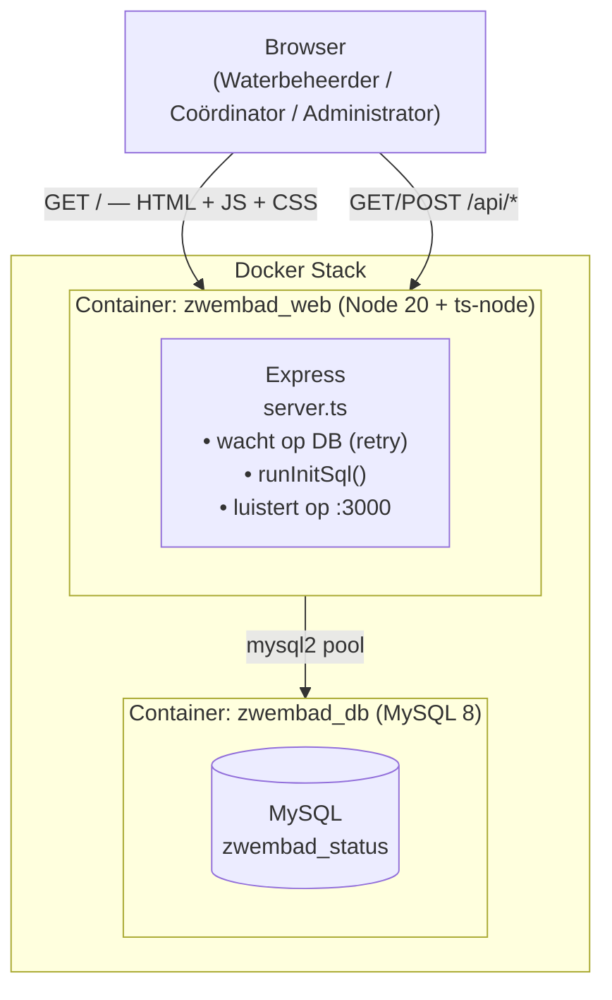
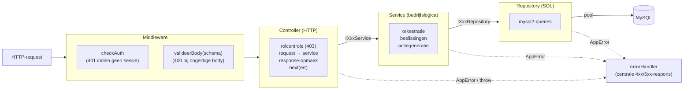
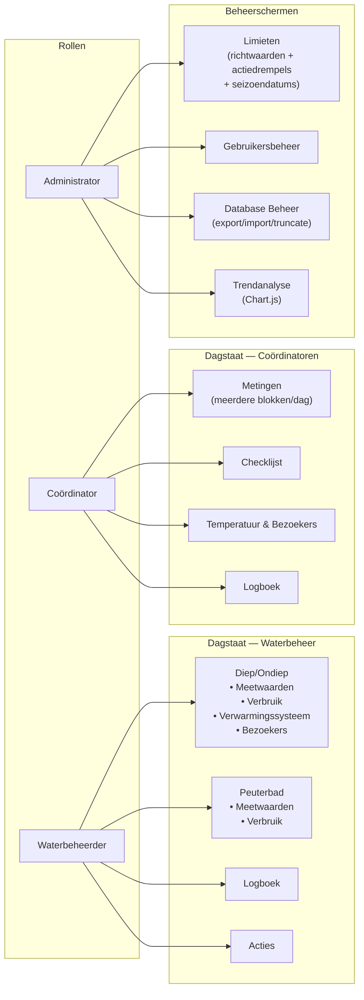

# Architectuur — Digitale Dagstaat Zwembad

Overzicht en index van de architectuurdocumentatie. De detailhoofdstukken staan
in [`docs/architecture/`](architecture/).

| Deel | Inhoud |
|------|--------|
| [Backend](architecture/backend.md)   | Gelaagde opbouw, request-lifecycle, middleware, endpoints, dependency injection |
| [Frontend](architecture/frontend.md) | ES6-class modules en de `Application`-container |
| [Flows](architecture/flows.md)       | Sequencediagrammen: opstarten, acties, autosave |
| [Database](architecture/database.md) | ER-diagram en tabellen |
| [Testing](architecture/testing.md)   | Teststrategie per laag |

---

## Systeemoverzicht

Full-stack applicatie voor het bijhouden van de dagelijkse waterkwaliteit van een
zwembad. TypeScript/Express-backend, vanilla-JS-frontend (ES6-klassen), MySQL 8,
gecontaineriseerd met Docker. Code en commentaar zijn in het Nederlands.



---

## Gelaagde architectuur

Elk domein (metingen, verbruik, coordinatoren, …) volgt dezelfde lagen. Een
controller hangt alleen van een **service-interface** af; een service alleen van
**repository-interfaces**. Afhankelijkheden wijzen naar binnen (Dependency
Inversion); concrete klassen worden in de route-factory samengesteld.



**Kernprincipes**

- **SRP** — controller doet HTTP, service doet logica, repository doet SQL.
- **DIP** — hogere lagen hangen van interfaces af, niet van implementaties.
- **Centrale foutafhandeling** — handlers roepen `next(err)`; `errorHandler`
  bepaalt de statuscode (uit `AppError`, anders 500) en de JSON-respons.
- **Validatie aan de rand** — `valideerBody` (Zod) valideert `req.body` vóór de
  controller; de service ontvangt gevalideerde data.

---

## Mappenstructuur (backend)

```
backend/
  server.ts                 # opstarten: pool, runInitSql, routes, listen
  errors.ts                 # AppError(message, status)
  auteur.ts                 # bepaalAuteur(gebruiker) — gedeelde helper
  types/index.ts            # domeintypes + express-session augmentatie
  middleware/
    auth.ts                 # checkAuth + rol-helpers
    valideer.ts             # valideerBody(schema)
    errorHandler.ts         # centrale foutafhandeling
  validation/schemas.ts     # Zod-schema's per domein
  routes/<domein>.ts        # factory: repos → service → controller
  controllers/<X>Controller.ts
  services/I<X>Service.ts + <X>Service.ts
  repositories/I<X>Repository.ts + <X>Repository.ts + db.ts
```

Zie [Backend](architecture/backend.md) voor de details.

---

## Rollen en toegang



De rolcontrole zit in de controllers (`isWaterbeheerder`,
`isWaterbeheerderOrCoordinator`, `isAdminOrWaterbeheerder` uit
`middleware/auth.ts`); `checkAuth` dwingt eerst een geldige sessie af.
