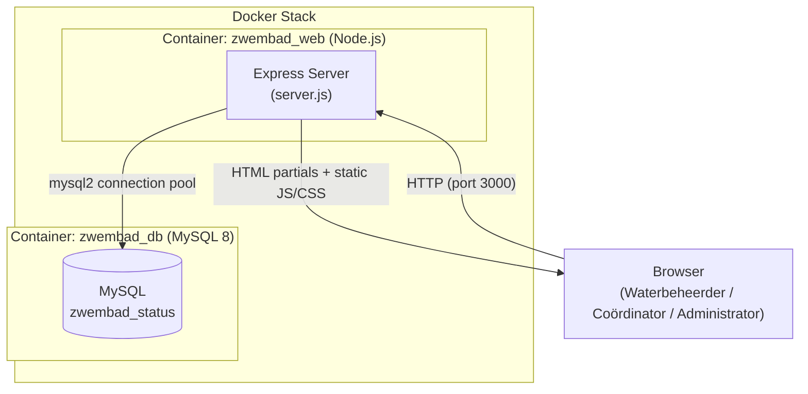
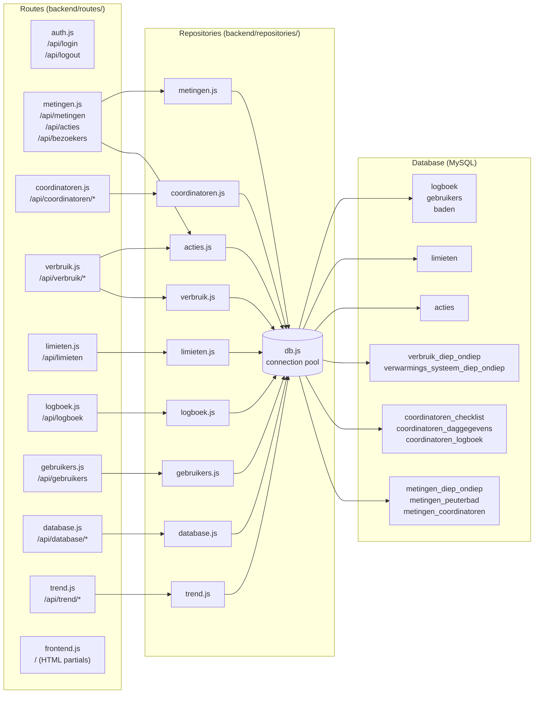
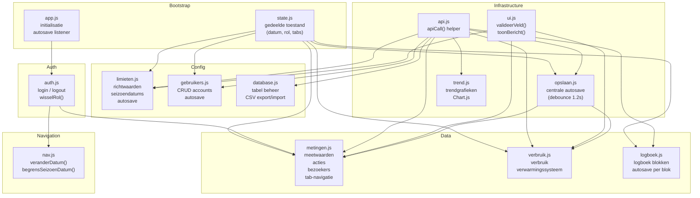
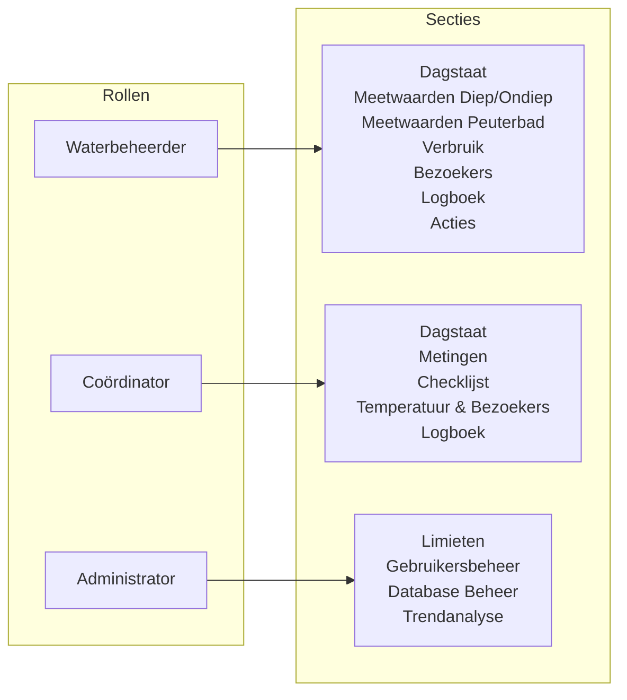
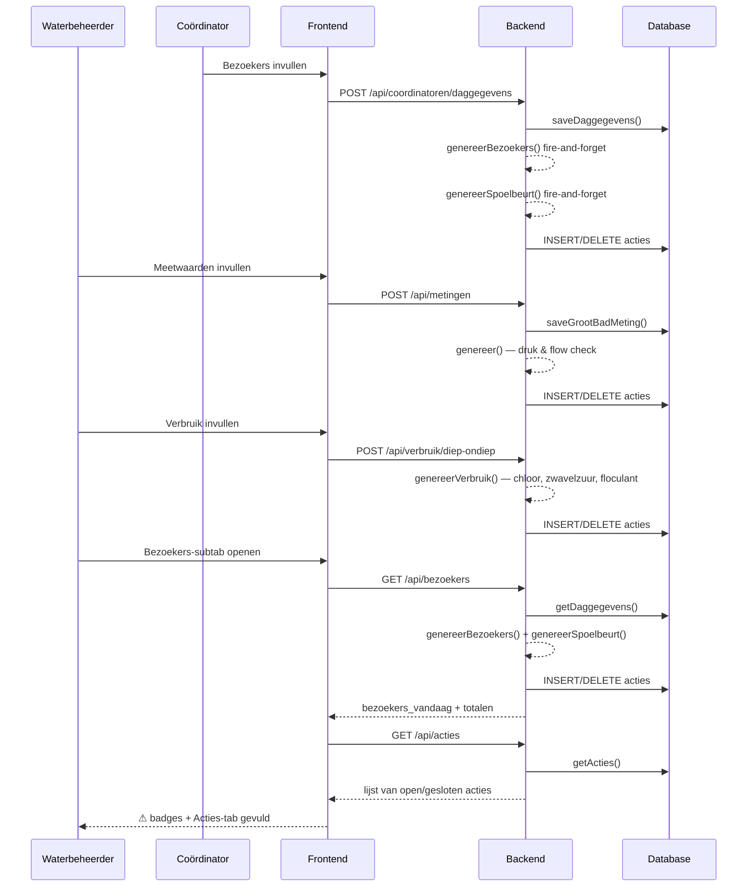
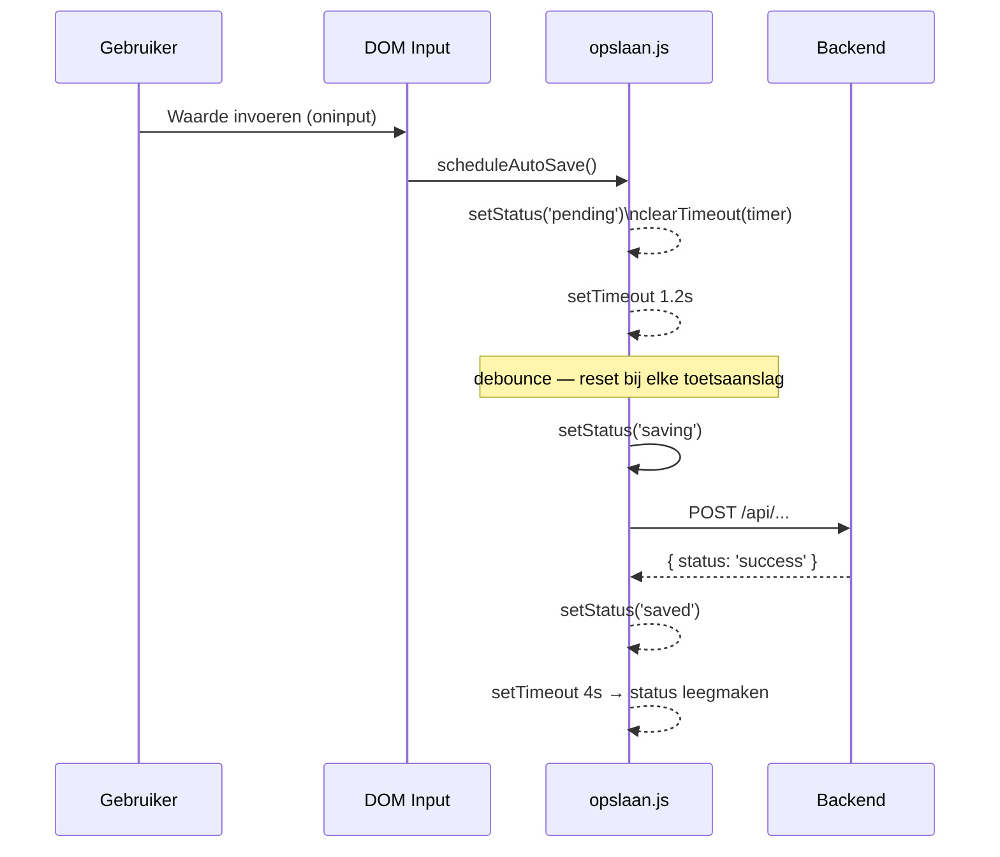
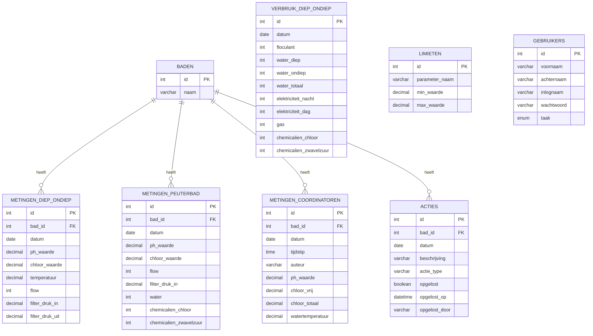

# Architectuur — Digitale Dagstaat Zwembad

---

## 1. Systeemoverzicht

---

## 2. Backend — lagen

---

## 3. Frontend — modules

---

## 4. Rollen en toegang

---

## 5. Acties-systeem — datavloed

---

## 6. Autosave — mechanisme

---

## 7. Database schema — tabellen per domein

