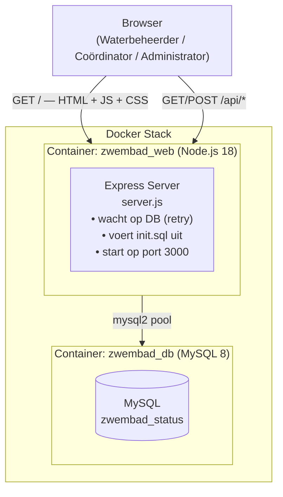
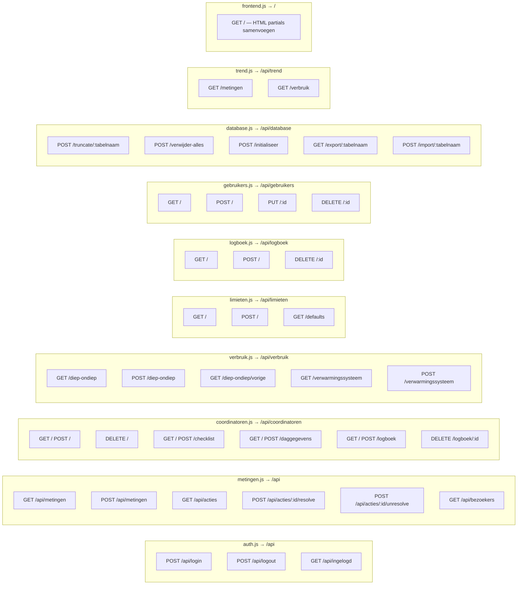
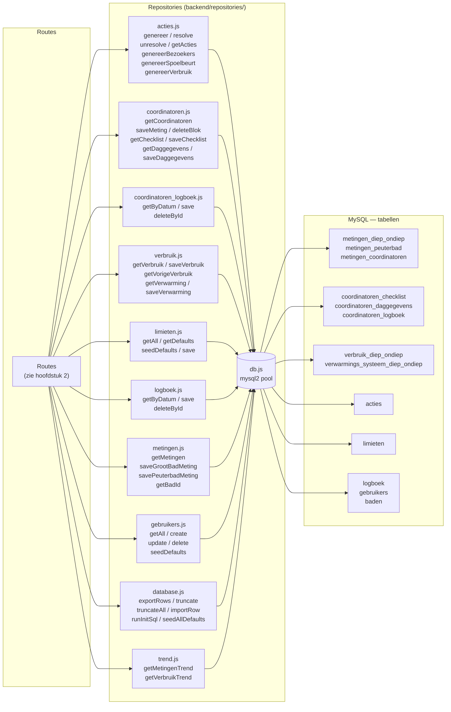
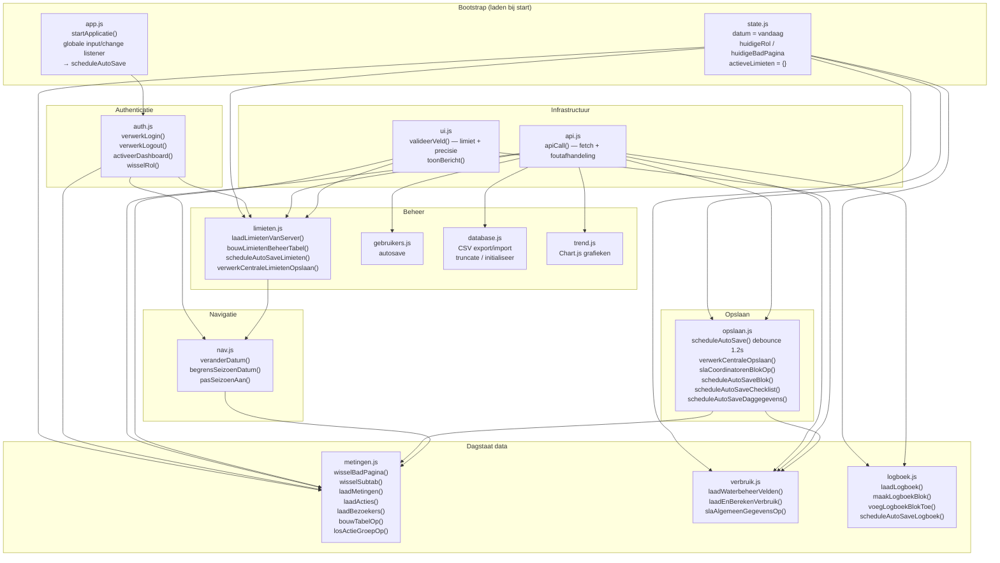
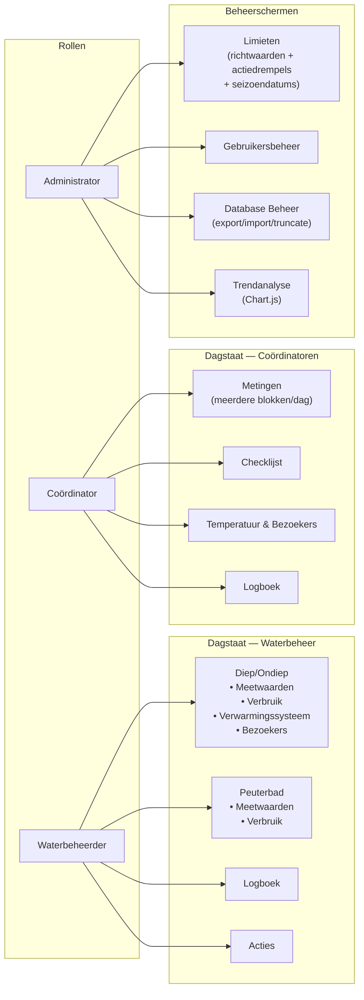
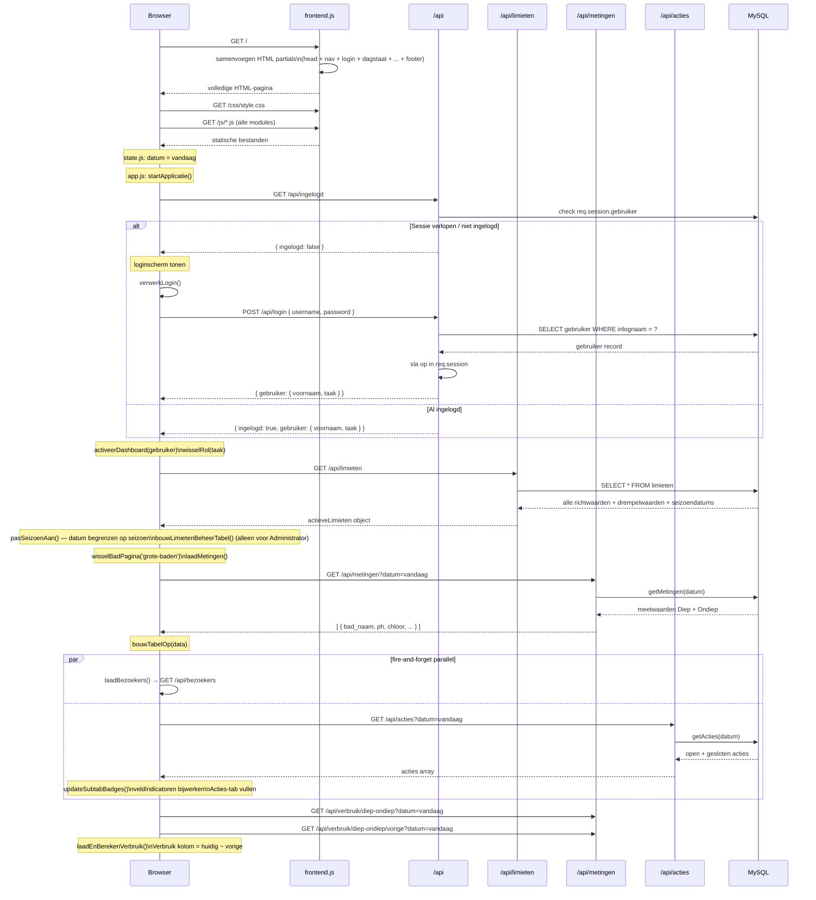
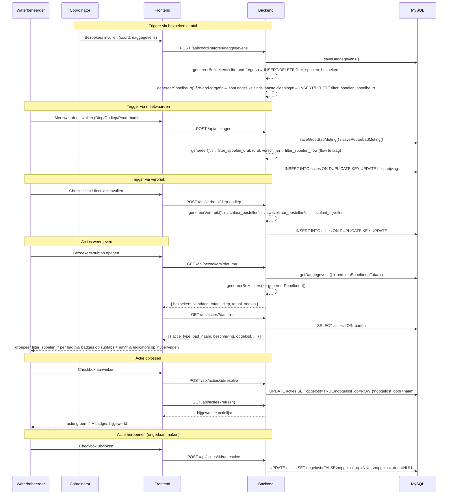
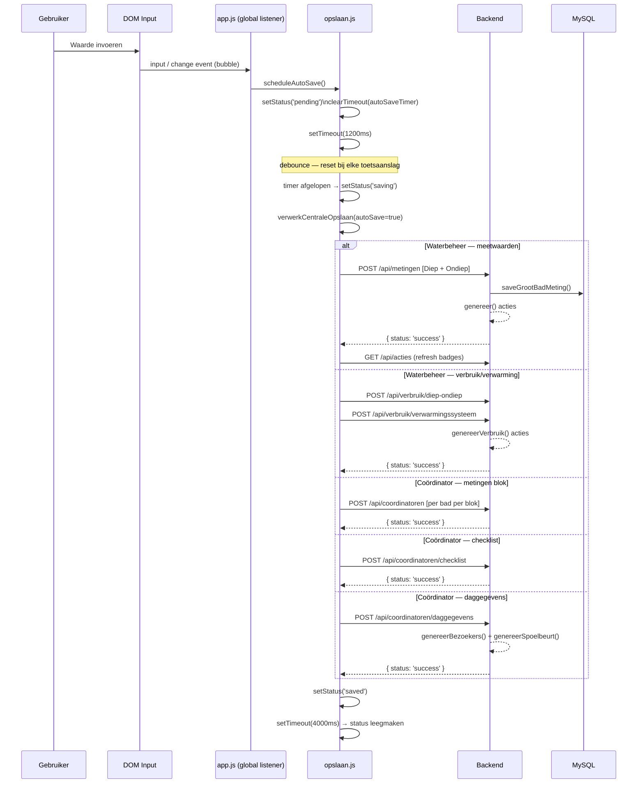

# Architectuur — Digitale Dagstaat Zwembad

---

## 1. Systeemoverzicht

---

## 2. Backend — routes en endpoints

---

## 3. Backend — repositories en database

---

## 4. Frontend — modules

---

## 5. Rollen en toegang

---

## 6. Sequencediagram — Applicatie opstarten

---

## 7. Sequencediagram — Acties aanmaken en oplossen

---

## 8. Sequencediagram — Autosave

---

## 9. Database schema — ER diagram

```mermaid
erDiagram
    BADEN {
        int id PK
        varchar naam
    }
    METINGEN_DIEP_ONDIEP {
        int id PK
        int bad_id FK
        date datum
        decimal ph_waarde
        decimal chloor_waarde
        decimal temperatuur
        int flow
        decimal filter_druk_in
        decimal filter_druk_uit
        decimal water
    }
    METINGEN_PEUTERBAD {
        int id PK
        int bad_id FK
        date datum
        decimal ph_waarde
        decimal chloor_waarde
        int flow
        decimal filter_druk_in
        int water
        int chemicalien_chloor
        int chemicalien_zwavelzuur
    }
    METINGEN_COORDINATOREN {
        int id PK
        int bad_id FK
        date datum
        time tijdstip
        varchar auteur
        decimal ph_waarde
        decimal chloor_vrij
        decimal chloor_totaal
        decimal watertemperatuur
        varchar helderheid
        tinyint bad_gebruikt
    }
    COORDINATOREN_CHECKLIST {
        int id PK
        date datum
        tinyint proef_waterspeel
        tinyint proef_spraypark
        tinyint proef_douches
        tinyint proef_glijbaan
    }
    COORDINATOREN_DAGGEGEVENS {
        int id PK
        date datum
        decimal lucht_temperatuur
        int bezoekers_vandaag
        int bezoekers_totaal_spoelbeurt
    }
    COORDINATOREN_LOGBOEK {
        int id PK
        date datum
        datetime tijdstip
        varchar auteur
        text tekst
    }
    LOGBOEK {
        int id PK
        date datum
        datetime tijdstip
        varchar auteur
        text tekst
    }
    VERBRUIK_DIEP_ONDIEP {
        int id PK
        date datum
        int floculant
        int water_diep
        int water_ondiep
        int water_totaal
        int elektriciteit_nacht
        int elektriciteit_dag
        int gas
        int chemicalien_chloor
        int chemicalien_zwavelzuur
    }
    VERWARMINGS_SYSTEEM {
        int id PK
        date datum
        boolean verwarming_status_1
        boolean verwarming_status_2
        boolean verwarming_status_3
        boolean verwarming_status_4
        boolean verwarming_druk_ok
        boolean verwarming_visuele_controle
    }
    ACTIES {
        int id PK
        int bad_id FK
        date datum
        varchar beschrijving
        varchar actie_type
        boolean opgelost
        datetime opgelost_op
        varchar opgelost_door
    }
    LIMIETEN {
        int id PK
        varchar parameter_naam
        decimal min_waarde
        decimal max_waarde
    }
    GEBRUIKERS {
        int id PK
        varchar voornaam
        varchar achternaam
        varchar inlognaam
        varchar wachtwoord
        enum taak
    }

    BADEN ||--o{ METINGEN_DIEP_ONDIEP : "heeft"
    BADEN ||--o{ METINGEN_PEUTERBAD : "heeft"
    BADEN ||--o{ METINGEN_COORDINATOREN : "heeft"
    BADEN ||--o{ ACTIES : "heeft"
```

