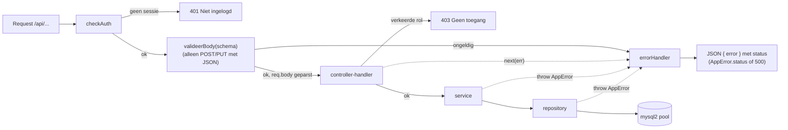
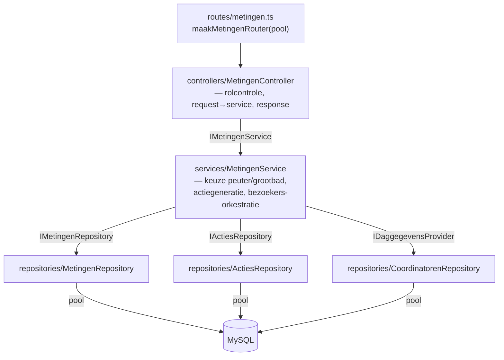
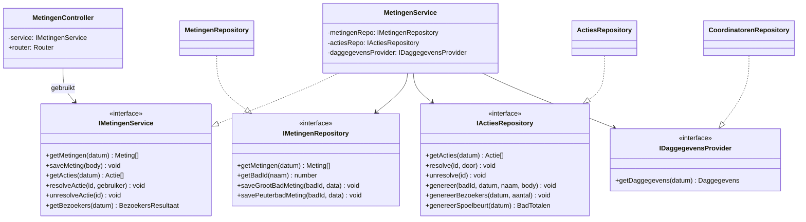
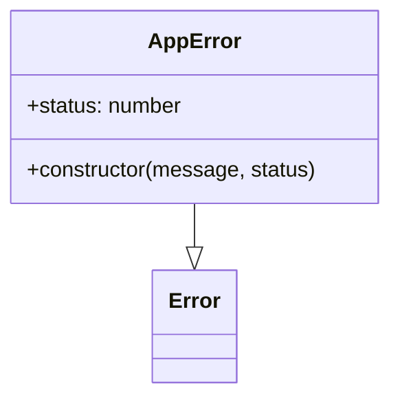
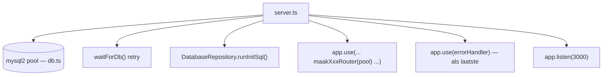

# Backend

TypeScript/Express, gelaagd en met dependency injection. Terug naar het
[overzicht](../architecture.md).

---

## 1. Request-lifecycle



De volgorde van middleware bij een muterende route is
`checkAuth → valideerBody(schema) → handler`. De rolcontrole gebeurt binnen de
handler (begin), waarna gedelegeerd wordt naar de service.

---

## 2. Lagen per domein

Elk domein heeft dezelfde keten. Voorbeeld met `metingen` als geheel:



`IDaggegevensProvider` is een smalle interface (alleen `getDaggegevens`) die de
`CoordinatorenRepository` implementeert — Interface Segregation: `MetingenService`
ziet alleen wat het nodig heeft.

### Klassendiagram — metingen

De controller hangt af van een service-**interface**; de service van
repository-**interfaces**. Concrete klassen (`..|>`) worden pas in de
route-factory gekoppeld. Elk domein volgt ditzelfde patroon.



### Foutklasse



`AppError(message, status)` wordt door services/repositories geworpen en door de
`errorHandler` vertaald naar de HTTP-statuscode; overige fouten worden 500.

---

## 3. Endpoints per domein

| Router (factory) | Mount | Endpoints | Rol |
|---|---|---|---|
| `auth.ts` | `/api` | `POST /login`, `POST /logout`, `GET /ingelogd` | — / sessie |
| `metingen.ts` | `/api` | `GET/POST /metingen`, `GET /acties`, `POST /acties/:id/resolve`, `POST /acties/:id/unresolve`, `GET /bezoekers` | waterbeheerder |
| `coordinatoren.ts` | `/api/coordinatoren` | `GET/POST /`, `DELETE /`, `GET/POST /checklist`, `GET/POST /daggegevens`, `GET/POST /logboek`, `DELETE /logboek/:id` | waterbeheerder of coördinator |
| `verbruik.ts` | `/api/verbruik` | `GET/POST /diep-ondiep`, `GET /diep-ondiep/vorige`, `GET/POST /verwarmingssysteem` | waterbeheerder |
| `limieten.ts` | `/api/limieten` | `GET /`, `GET /defaults`, `POST /` | lezen: vrij · schrijven: admin/waterbeheerder |
| `logboek.ts` | `/api/logboek` | `GET /`, `POST /`, `DELETE /:id` | waterbeheerder |
| `gebruikers.ts` | `/api/gebruikers` | `GET /`, `POST /`, `PUT /:id`, `DELETE /:id` | admin/waterbeheerder |
| `database.ts` | `/api/database` | `POST /truncate/:tabel`, `POST /verwijder-alles`, `POST /initialiseer`, `GET /export/:tabel`, `POST /import/:tabel` | admin/waterbeheerder |
| `trend.ts` | `/api/trend` | `GET /metingen`, `GET /verbruik` | waterbeheerder |
| `frontend.ts` | `/` | `GET /` — HTML-partials samenvoegen | — |

---

## 4. Middleware en gedeelde bouwstenen

| Bestand | Verantwoordelijkheid |
|---|---|
| `middleware/auth.ts` | `checkAuth` (401 zonder sessie) + rol-helpers `isWaterbeheerder`, `isWaterbeheerderOrCoordinator`, `isAdminOrWaterbeheerder` |
| `middleware/valideer.ts` | `valideerBody(schema)` — valideert `req.body` met Zod, vervangt door geparste waarde, gooit `AppError(400)` |
| `middleware/errorHandler.ts` | centrale foutafhandeling: `AppError.status` of 500, logt alleen 5xx |
| `validation/schemas.ts` | Zod-schema's per domein (los voor metingen/verbruik/coordinatoren, strikt voor gebruiker/limiet/login) |
| `errors.ts` | `AppError(message, status)` |
| `auteur.ts` | `bepaalAuteur(gebruiker)` — naamafleiding voor logboek/acties |
| `types/index.ts` | domeintypes + `declare module 'express-session'` augmentatie voor `req.session.gebruiker` |

---

## 5. Dependency injection — samenstelling

De route-factory is het enige punt waar concrete klassen worden gekoppeld. Alle
lagen daarboven kennen alleen interfaces.

```typescript
// routes/metingen.ts
export function maakMetingenRouter(pool: Pool): Router {
    const metingenRepo = new MetingenRepository(pool);
    const actiesRepo   = new ActiesRepository(pool);
    const coordRepo    = new CoordinatorenRepository(pool);
    const service      = new MetingenService(metingenRepo, actiesRepo, coordRepo);
    const controller   = new MetingenController(service);
    return controller.router;
}
```

`server.ts` maakt de gedeelde `pool` en `DatabaseRepository` (voor `runInitSql`
bij het opstarten), mount alle routers en als laatste de `errorHandler`.



---

## 6. Niet-triviale logica

- **Actiegeneratie** is fire-and-forget na een meting/daggegevens-save — geen
  transactionele garantie tussen de save en de gegenereerde actie.
- **Spoelbeurt-totaal** is cumulatief sinds de laatst opgeloste
  `filter_spoelen_spoelbeurt`-actie (zie `ActiesRepository`).
- **CSV-export/-import** zit in `DatabaseService`: puntkomma-gescheiden voor
  EU-Excel; import vertaalt `bad_naam` → `bad_id` voor metingen-tabellen en
  schakelt foreign-key-checks tijdelijk uit.
- **`init.sql`** draait bij elke start (`CREATE TABLE IF NOT EXISTS` +
  `INSERT IGNORE`) — idempotent, geen migratietool.
