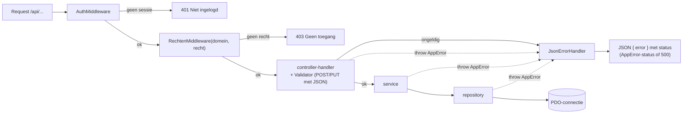
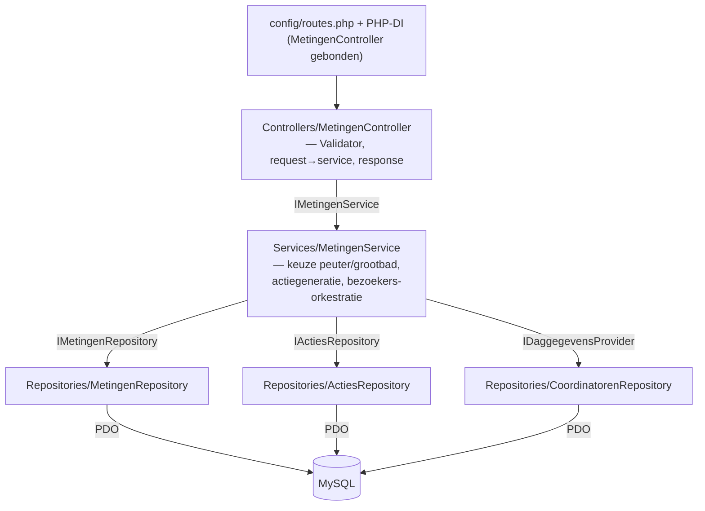
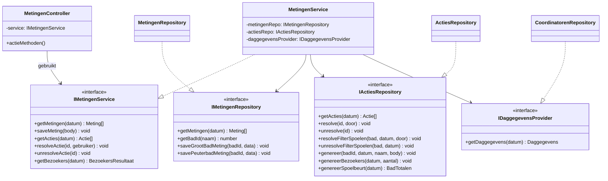
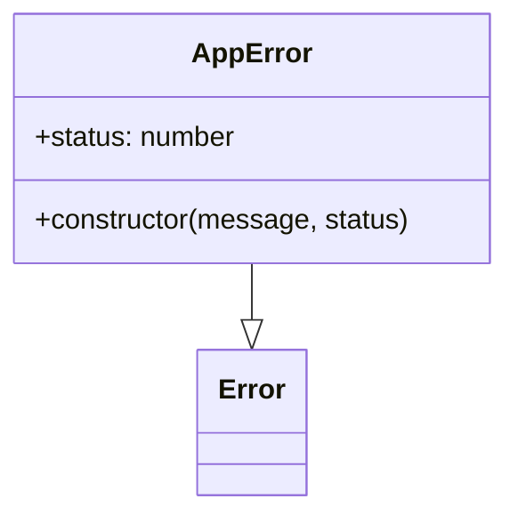
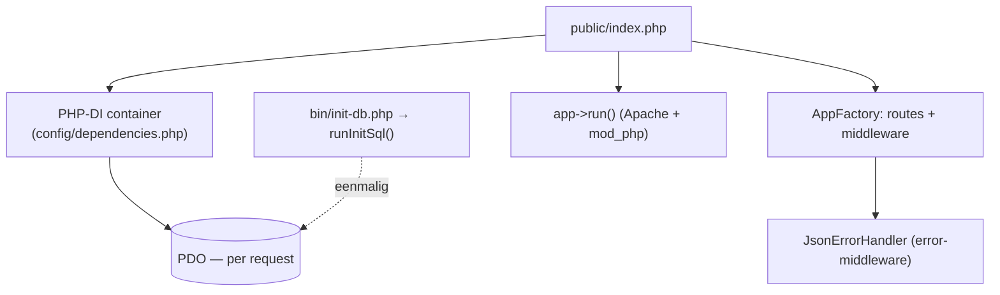

# Backend

PHP 8.0 (Slim 4 + PHP-DI), gelaagd en met dependency injection. Terug naar het
[overzicht](../architecture.md).

---

## 1. Request-lifecycle



De PSR-15-keten bij een muterende route is
`SessionMiddleware (op /api) → AuthMiddleware → RechtenMiddleware → handler`. De
controller roept de `Validator` voor het domein aan en delegeert daarna naar de
service.

---

## 2. Lagen per domein

Elk domein heeft dezelfde keten. Voorbeeld met `metingen` als geheel:



`IDaggegevensProvider` is een smalle interface (alleen `getDaggegevens`) die de
`CoordinatorenRepository` implementeert — Interface Segregation: `MetingenService`
ziet alleen wat het nodig heeft.

### Klassendiagram — metingen

De controller hangt af van een service-**interface**; de service van
repository-**interfaces**. Concrete klassen (`..|>`) worden pas in de
PHP-DI-container (`config/dependencies.php`) gekoppeld. Elk domein volgt ditzelfde
patroon.



### Rondetaken en Taken

Twee domeinen verzorgen de dagelijkse takenweergave:

- **`rondetaken`** — vaste dagelijkse onderhoudstaken. De catalogus (welke taken,
  per `gebied` en `pagina`, met `prioriteit` kritiek/normaal) staat in code in
  `RondetakenRepository`; alleen voltooiingen worden bewaard in
  `rondetaken_voltooid`. Een filter-rondetaak afvinken lost via
  `ActiesRepository.resolveFilterSpoelen` ook de openstaande `filter_spoelen_*`-
  acties van dat bad op (eenrichtingskoppeling).
- **`taken`** — een **read-only compositie** die `RondetakenRepository` en
  `ActiesRepository` samenvoegt tot één `TaakItem[]` per bad-pagina:
  `filter_spoelen_*`-acties vouwen samen op de filter-rondetaak, overige acties
  worden losse alarm-rijen (chemicaliën onder "Algemeen"). De `categorie`
  markeert wat verplicht is: een filter-rondetaak die vandaag een alarm heeft
  gehad (open **óf** al opgelost) blijft `verplicht` — dus ook ná afvinken blijft
  hij in de Verplicht-sectie staan (afgestreept, mét reden) i.p.v. terug te
  zakken naar belangrijk/overig. Schrijfacties lopen via de bestaande
  `/api/rondetaken`- en `/api/acties`-endpoints.

### Foutklasse



`AppError(message, status)` wordt door controllers/services/repositories geworpen en
door de `JsonErrorHandler` (Slim error-middleware) vertaald naar de HTTP-statuscode;
overige fouten worden 500.

---

## 3. Endpoints per domein

> Routes staan in `config/routes.php` en dispatchen naar onderstaande controllers;
> de rolkolom wordt afgedwongen door `AuthMiddleware` + `RechtenMiddleware`.
> Padparameters gebruiken Slims `{naam}`-syntax.

| Controller                | Mount                | Endpoints                                                                                                              | Rol                                               |
| ------------------------- | -------------------- | ---------------------------------------------------------------------------------------------------------------------- | ------------------------------------------------- |
| `AuthController`          | `/api`               | `POST /login`, `POST /logout`, `GET /ingelogd`                                                                         | — / sessie                                        |
| `MetingenController`      | `/api`               | `GET/POST /metingen`, `GET /acties`, `POST /acties/{id}/resolve`, `POST /acties/{id}/unresolve`, `GET /bezoekers`      | waterbeheerder                                    |
| `RondetakenController`    | `/api/rondetaken`    | `GET /`, `POST /{sleutel}/voltooi`, `POST /{sleutel}/heropen`                                                          | waterbeheerder                                    |
| `TakenController`         | `/api/taken`         | `GET /` — samengestelde taken-/actielijst per bad-pagina                                                               | waterbeheerder                                    |
| `CoordinatorenController` | `/api/coordinatoren` | `GET/POST /`, `DELETE /`, `GET/POST /checklist`, `GET/POST /daggegevens`, `GET/POST /logboek`, `DELETE /logboek/{id}`  | waterbeheerder of coördinator                     |
| `VerbruikController`      | `/api/verbruik`      | `GET/POST /diep-ondiep`, `GET /diep-ondiep/vorige`, `GET/POST /verwarmingssysteem`                                     | waterbeheerder                                    |
| `LimietenController`      | `/api/limieten`      | `GET /`, `GET /defaults`, `POST /`                                                                                     | lezen: elke rol · schrijven: **Administrator**    |
| `ActieTekstenController`  | `/api/actieteksten`  | `GET /`, `GET /defaults`, `POST /`                                                                                     | lezen: elke rol · schrijven: **Administrator**    |
| `DienstController`        | `/api/dienst`        | `GET /`, `GET /waterbeheerders`, `POST /`                                                                              | lezen: elke rol · schrijven: admin/waterbeheerder |
| `LogboekController`       | `/api/logboek`       | `GET /`, `POST /`, `DELETE /{id}`                                                                                      | waterbeheerder                                    |
| `GebruikersController`    | `/api/gebruikers`    | `GET /`, `POST /`, `PUT /{id}`, `DELETE /{id}`                                                                         | admin/waterbeheerder                              |
| `DatabaseController`      | `/api/database`      | `POST /truncate/{tabel}`, `POST /verwijder-alles`, `POST /initialiseer`, `GET /export/{tabel}`, `POST /import/{tabel}` | admin/waterbeheerder                              |
| `TrendController`         | `/api/trend`         | `GET /metingen`, `GET /verbruik`                                                                                       | waterbeheerder                                    |
| `ConfiguratieController`  | `/api/configuratie`  | `GET /`, `PUT /{sleutel}`                                                                                              | lezen: elke rol · schrijven: **Administrator**    |
| `VersieController`        | `/api/versie`        | `GET /` — `{ versie, commit }` voor het kop-label                                                                      | ingelogd                                          |
| `FrontendController`      | `/`                  | `GET /` — HTML-partials samenvoegen; `/js`, `/css`, `/images` serveren                                                 | —                                                 |

> `POST /api/metingen` en `POST /api/verbruik/{diep-ondiep,verwarmingssysteem}`
> nemen een verwachte `versie` mee en geven `{ versie, auteur, bijgewerkt_op }`
> terug; bij een versieverschil volgt **409** (optimistische concurrency, zie §6).

---

## 4. Middleware en gedeelde bouwstenen

| Bestand                            | Verantwoordelijkheid                                                                                      |
| ---------------------------------- | --------------------------------------------------------------------------------------------------------- |
| `src/Middleware/AuthMiddleware`    | 401 zonder geldige sessie                                                                                 |
| `src/Middleware/RechtenMiddleware` | `(domein, 'lezen'\|'schrijven')` — 403 zonder het juiste recht (vervangt de oude rol-helpers)             |
| `src/Middleware/SessionMiddleware` | start native `$_SESSION` alleen op `/api`; handhaaft de sliding idle-time-out                             |
| `src/Errors/JsonErrorHandler`      | centrale foutafhandeling: `AppError`-status of 500, logt alleen 5xx                                       |
| `src/Validation/Validator`         | per-domein validatieregels (los voor metingen/verbruik/coordinatoren, strikt voor gebruiker/limiet/login) |
| `src/Errors/AppError`              | `AppError(message, status)`                                                                               |
| `src/Support/Auteur`               | naamafleiding voor logboek/acties                                                                         |
| `src/Support/` (overig)            | `Optimistisch`, `Historie`, `Wachtwoord` (bcrypt), `Frontend` (partials/assets), `Json`                   |

---

## 5. Dependency injection — samenstelling

De PHP-DI-container (`config/dependencies.php`) is het enige punt waar concrete
klassen worden gekoppeld. Alle lagen daarboven kennen alleen interfaces.

```php
// config/dependencies.php (fragment)
IMetingenRepository::class => fn (ContainerInterface $c) => new MetingenRepository($c->get(PDO::class)),
IActiesRepository::class   => fn (ContainerInterface $c) => new ActiesRepository($c->get(PDO::class)),
IMetingenService::class    => fn (ContainerInterface $c) => new MetingenService(
    $c->get(IMetingenRepository::class),
    $c->get(IActiesRepository::class),
    $c->get(ICoordinatorenRepository::class), // implementeert ook IDaggegevensProvider
),
// config/routes.php koppelt vervolgens de HTTP-routes aan MetingenController, met de middleware.
```

`public/index.php` bouwt de container, laat de `AppFactory` de Slim-`App` samenstellen
(routes + `JsonErrorHandler` als error-middleware) en draait die. Het schema wordt
apart, eenmalig, gezet met `bin/init-db.php` (`runInitSql`).



---

## 6. Niet-triviale logica

- **Actiegeneratie** is fire-and-forget na een meting/daggegevens-save — geen
  transactionele garantie tussen de save en de gegenereerde actie.
- **Spoelbeurt** wordt per bad afgemeten tegen de laatste filterreiniging — de
  meest recente van een opgeloste `filter_spoelen_spoelbeurt`-actie óf een
  afgevinkte filter-rondetaak (`diep_filter`/`ondiep_filter`). `ActiesRepository.berekenSpoelbeurt`
  levert vanaf dat ankerpunt zowel het **cumulatieve bezoekersaantal** (drempel
  `actie_spoelbeurt_max` → `filter_spoelen_spoelbeurt`) als het **aantal dagen
  sinds de reiniging** (via `DATEDIFF`, drempel `actie_spoelbeurt_dagen`, standaard
  7 → `filter_spoelen_dagen`). Zonder ankerpunt (nog nooit gereinigd) is `dagen`
  `null` en blijft de dagen-actie uit.
- **CSV-export/-import** zit in `DatabaseService`: puntkomma-gescheiden voor
  EU-Excel; import vertaalt `bad_naam` → `bad_id` voor metingen-tabellen en
  schakelt foreign-key-checks tijdelijk uit.
- **`init.sql`** wordt door `bin/init-db.php` toegepast (`runInitSql`, per-statement
  try/catch): `CREATE TABLE IF NOT EXISTS` + `INSERT IGNORE` + losse `ALTER`-migraties
  — idempotent, geen migratietool. **Niet** `mysql < init.sql` (de dubbele `ALTER`s
  laten de client afbreken).
- **Optimistische concurrency** op de waterbeheer meetwaarden/verbruik-tabellen
  via `Support\Optimistisch`: een conditionele `UPDATE … WHERE sleutel AND versie = ?`
  voorkomt stille "lost updates" — bij een versieverschil volgt `AppError(409)`. De
  repo's geven de nieuwe `versie`/`auteur`/`bijgewerkt_op` terug; de controller zet
  `auteur` uit de sessie (`Support\Auteur`).
- **Configureerbare, sliding sessie-time-out:** één gedeelde `ConfiguratieService`
  (in-memory cache) voedt zowel de `SessionMiddleware` — die per `/api`-request de
  laatste activiteit bijhoudt en de cookie-`Max-Age` meeschuift — als de
  `/api/configuratie`-router, zodat een admin-wijziging direct (zonder herstart)
  doorwerkt. `ApiClient` stuurt een 401 terug naar het loginscherm met uitleg.
