# Database

MySQL 8. Het schema wordt idempotent aangemaakt door `init.sql`, toegepast via
`bin/init-db.php` (`runInitSql`, per-statement try/catch met `CREATE TABLE IF NOT EXISTS`,
`INSERT IGNORE` en losse `ALTER`-migraties); er is geen migratietool. Terug naar het
[overzicht](../architecture.md).

```mermaid
erDiagram
    BADEN {
        int id PK
        varchar naam
    }
    METINGEN_DIEP_ONDIEP {
        int id PK
        int bad_id FK
        date datum
        decimal ph_waarde
        decimal chloor_waarde
        decimal temperatuur
        int flow
        decimal filter_druk_in
        decimal filter_druk_uit
        decimal kathodische_bescherming
        int versie
        varchar auteur
        timestamp bijgewerkt_op
    }
    METINGEN_PEUTERBAD {
        int id PK
        int bad_id FK
        date datum
        decimal ph_waarde
        decimal chloor_waarde
        int flow
        decimal filter_druk_in
        int water
        int chemicalien_chloor
        int chemicalien_zwavelzuur
        int versie
        varchar auteur
        timestamp bijgewerkt_op
    }
    METINGEN_COORDINATOREN {
        int id PK
        int bad_id FK
        date datum
        time tijdstip
        varchar auteur
        decimal ph_waarde
        decimal chloor_vrij
        decimal chloor_totaal
        decimal watertemperatuur
        varchar helderheid
        tinyint bad_gebruikt
    }
    COORDINATOREN_CHECKLIST {
        int id PK
        date datum
        tinyint proef_waterspeel
        tinyint proef_spraypark
        tinyint proef_douches
        tinyint proef_glijbaan
    }
    COORDINATOREN_DAGGEGEVENS {
        int id PK
        date datum
        decimal lucht_temperatuur
        int bezoekers_vandaag
        int bezoekers_totaal_spoelbeurt
    }
    COORDINATOREN_LOGBOEK {
        int id PK
        date datum
        datetime tijdstip
        varchar auteur
        text tekst
    }
    LOGBOEK {
        int id PK
        date datum
        datetime tijdstip
        varchar auteur
        text tekst
    }
    VERBRUIK_DIEP_ONDIEP {
        int id PK
        date datum
        int floculant
        int water_diep
        int water_ondiep
        int water_totaal
        int elektriciteit_nacht
        int elektriciteit_dag
        int gas
        int chemicalien_chloor
        int chemicalien_zwavelzuur
        int versie
        varchar auteur
        timestamp bijgewerkt_op
    }
    VERWARMINGS_SYSTEEM {
        int id PK
        date datum
        boolean verwarming_status_1
        boolean verwarming_status_2
        boolean verwarming_status_3
        boolean verwarming_status_4
        boolean verwarming_druk_ok
        boolean verwarming_visuele_controle
        int versie
        varchar auteur
        timestamp bijgewerkt_op
    }
    CONFIGURATIE {
        varchar sleutel PK
        varchar waarde
        varchar omschrijving
        varchar type
        timestamp bijgewerkt_op
    }
    ACTIES {
        int id PK
        int bad_id FK
        date datum
        varchar beschrijving
        varchar actie_type
        boolean opgelost
        datetime opgelost_op
        varchar opgelost_door
    }
    RONDETAKEN_VOLTOOID {
        int id PK
        varchar taak_sleutel
        date datum
        datetime voltooid_op
        varchar voltooid_door
    }
    LIMIETEN {
        int id PK
        varchar parameter_naam
        decimal min_waarde
        decimal max_waarde
    }
    GEBRUIKERS {
        int id PK
        varchar voornaam
        varchar achternaam
        varchar inlognaam
        varchar wachtwoord
        enum taak
    }

    BADEN ||--o{ METINGEN_DIEP_ONDIEP : "heeft"
    BADEN ||--o{ METINGEN_PEUTERBAD : "heeft"
    BADEN ||--o{ METINGEN_COORDINATOREN : "heeft"
    BADEN ||--o{ ACTIES : "heeft"
```

> `RONDETAKEN_VOLTOOID` heeft geen `bad_id`-FK: de rondetaakcatalogus (welke
> taken er bestaan, per gebied/pagina) staat in code (`RondetakenRepository`).
> De tabel bewaart enkel de afgevinkte taken per dag, uniek op
> `(taak_sleutel, datum)` — een nieuwe dag = geen rijen = alles weer onafgevinkt.

> Niet getoond (eigen daily-tabellen met dezelfde patronen): `COORDINATOREN_CHECKLIST`
> en `COORDINATOREN_DAGGEGEVENS` (beide met `auteur`), `ACTIE_TEKSTEN`
> (`actie_sleutel` PK, bewerkbare sjablonen) en `WATERBEHEER_DIENST` (`datum` PK,
> `dienst_1`/`dienst_2`).

## Optimistische concurrency & attributie

De waterbeheer meetwaarden/verbruik-tabellen (`metingen_diep_ondiep`,
`metingen_peuterbad`, `verbruik_diep_ondiep`, `verwarmings_systeem_diep_ondiep`)
hebben elk `versie` (INT, optimistic-concurrency-token), `auteur` (wie sloeg als
laatste op) en `bijgewerkt_op` (TIMESTAMP). Opslaan loopt via de gedeelde helper
`Support\Optimistisch`: een conditionele `UPDATE … WHERE sleutel AND versie = ?` (de
rij-lock serialiseert gelijktijdige schrijvers); komt de versie niet overeen, dan
krijgt de client **409** in plaats van een stille overschrijving. De
`configuratie`-tabel is een generieke sleutel/waarde-store (o.a.
`sessie_timeout_minuten`).

## Toegang

Alle tabellen worden uitsluitend benaderd via de repositories (`src/Repositories/`),
elk met een per-request PDO-connectie (geen pool). `LIMIETEN`, `GEBRUIKERS` en
`CONFIGURATIE` worden bij een verse database voorzien van standaardwaarden (de
limieten en 2 gebruikers via de seed in `DatabaseRepository`; de `configuratie`-seed
staat in `init.sql`). Wachtwoorden worden met bcrypt gehasht (`Support\Wachtwoord`).
