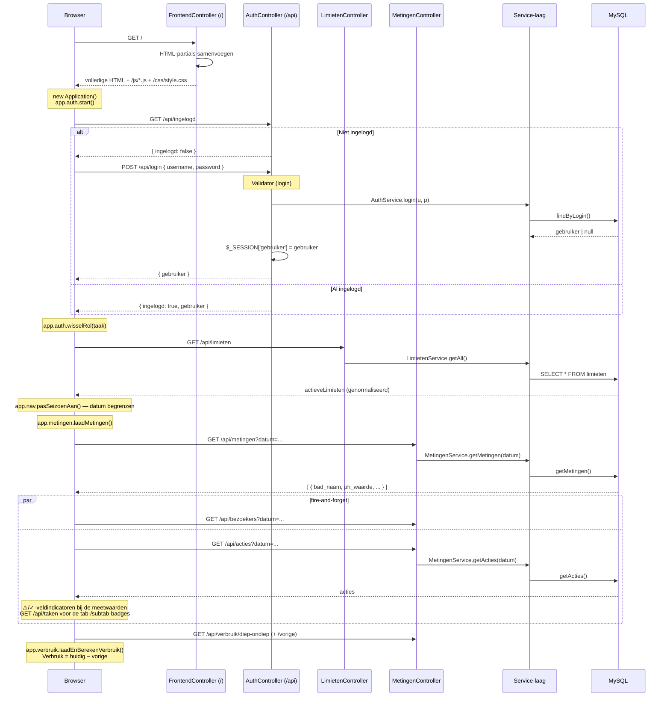
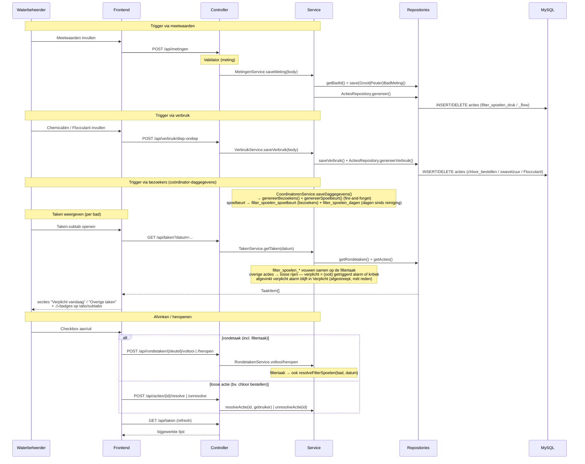
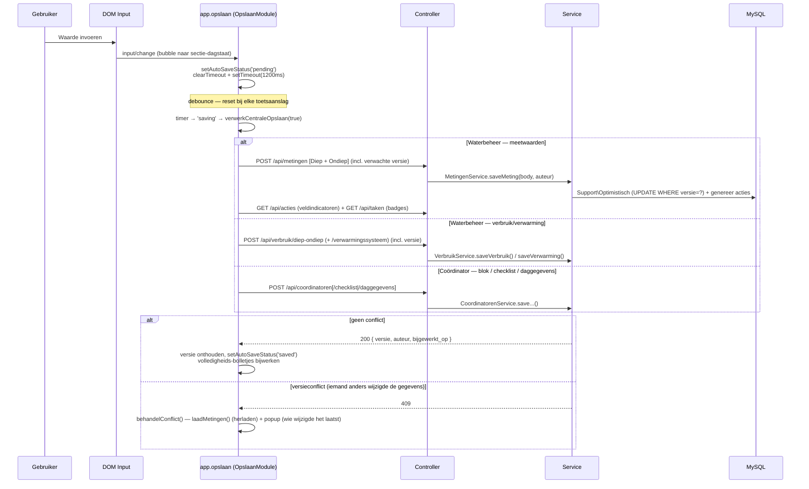

# Flows

Sequencediagrammen van de belangrijkste scenario's. Terug naar het
[overzicht](../architecture.md). De backend toont de lagen
controller → service → repository.

---

## 1. Applicatie opstarten

---

## 2. Acties genereren · Taken weergeven en afvinken

---

## 3. Autosave

