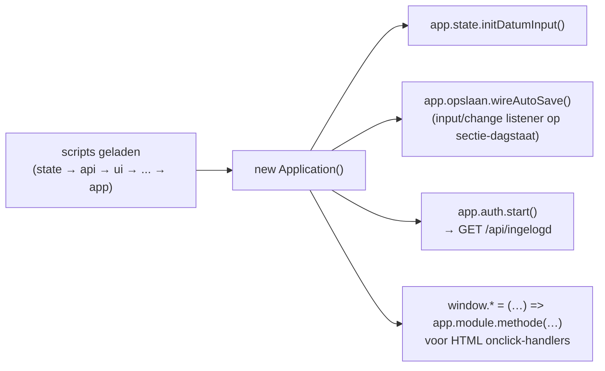
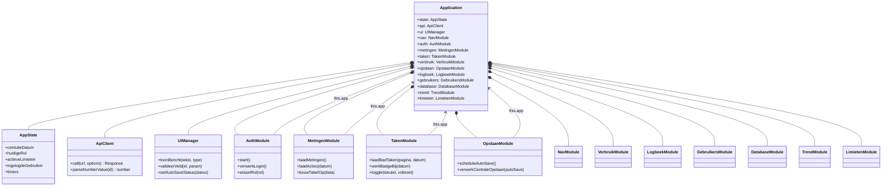

# Frontend

Vanilla JavaScript met ES6-klassen, zonder bundler. Terug naar het
[overzicht](../architecture.md).

---

## 1. Application-container (dependency injection)

`app.js` maakt één `Application`-instantie aan die alle modules als singletons
bevat. Elke module krijgt `app` als enige constructor-argument en roept andere

```mermaid
graph TB
    App["Application (app.js)\n— maakt alle modules\n— exposeert ~25 window.* globals"]

    App --> State["AppState\n(datum, rol, subtabs,\nactieveLimieten, timers)"]
    App --> Api["ApiClient\ncall() · parseNumberValue()"]
    App --> UI["UIManager\ntoonBericht · valideerVeld\nzetInputValue · setAutoSaveStatus"]
    App --> Auth["AuthModule\nstart · verwerkLogin/Logout\nwisselRol"]
    App --> Nav["NavModule\nveranderDatum · begrensSeizoenDatum"]
    App --> Met["MetingenModule\nlaadMetingen · bouwtabel\nveldindicatoren · coordinator-blokken"]
    App --> Taken["TakenModule\nlaadBadTaken · toggle\nVerplicht/Overige + ⚠-badges"]
    App --> Verb["VerbruikModule\nladen · opslaan · berekenen"]
    App --> Save["OpslaanModule\nscheduleAutoSave (1.2s debounce)\nverwerkCentraleOpslaan"]
    App --> Log["LogboekModule"]
    App --> Geb["GebruikersModule"]
    App --> DBm["DatabaseModule\nCSV import/export"]
    App --> Trend["TrendModule\nChart.js"]
    App --> Lim["LimietenModule"]
```

modules aan via `this.app.<module>.<methode>()`. De scripts worden sequentieel
als `<script>`-tags geladen (geen `import`/bundler).

---

## 2. Opstarten en globale functies

Alleen de functies die HTML `onclick`-handlers nodig hebben staan op `window`
(bv. `wisselRol`, `veranderDatum`, `voegNieuwBlokToe`, `toggleTaak`). Alle
overige communicatie loopt via de container, niet via globals.

### Klassendiagram

`Application` bezit (`*--`) alle modules als singletons; elke module krijgt
`app` in de constructor en roept andere modules aan via `this.app` (`-->`).

> Alleen een representatieve set methoden is getoond; `NavModule`,
> `VerbruikModule`, `LogboekModule`, `GebruikersModule`, `DatabaseModule`,
> `TrendModule` en `LimietenModule` volgen hetzelfde patroon (constructor met
> `app`, aanroepen via `this.app`).

---

## 3. Verantwoordelijkheden per module

| Module               | Verantwoordelijkheid                                                                                                                                                                                           |
| -------------------- | -------------------------------------------------------------------------------------------------------------------------------------------------------------------------------------------------------------- |
| `AppState`           | Eén bron van waarheid voor gedeelde toestand en timers                                                                                                                                                         |
| `ApiClient`          | `fetch`-wrapper met credentials; `parseNumberValue` (komma→punt)                                                                                                                                               |
| `UIManager`          | Statusberichten, veldvalidatie tegen limieten, auto-save-indicator                                                                                                                                             |
| `NavModule`          | Datumnavigatie met begrenzing op de seizoengrenzen                                                                                                                                                             |
| `AuthModule`         | Inloggen/uitloggen, dashboard activeren, rol wisselen                                                                                                                                                          |
| `MetingenModule`     | Metingen laden/tonen, ⚠/✓-veldindicatoren bij de meetwaarden, coördinator-blokken                                                                                                                              |
| `TakenModule`        | Taken-subtab per bad: "Verplicht vandaag" vs "Overige taken"; afvinken via rondetaken-/acties-endpoints; een afgevinkte verplichte taak blijft in Verplicht (afgestreept, mét reden); ⚠-badges op tabs/subtabs |
| `VerbruikModule`     | Verbruik/verwarming laden, opslaan, dagdelta berekenen                                                                                                                                                         |
| `OpslaanModule`      | Alle auto-save-orkestratie (centraal + per blok), 1.2 s debounce                                                                                                                                               |
| `LogboekModule`      | Logboekblokken voor waterbeheer en coördinatoren                                                                                                                                                               |
| `GebruikersModule`   | Gebruikersbeheer met auto-save per rij                                                                                                                                                                         |
| `DatabaseModule`     | CSV-import/-export, truncate, herinitialisatie                                                                                                                                                                 |
| `TrendModule`        | Chart.js-grafieken voor metingen en verbruik                                                                                                                                                                   |
| `LimietenModule`     | Limieten laden/renderen/opslaan (auto-save)                                                                                                                                                                    |
| `ActieTekstenModule` | Actie-tekstsjablonen laden/renderen/opslaan (auto-save) met live placeholder-preview (Administrator)                                                                                                           |
| `DienstModule`       | "Dienst vandaag"-chip: dienstpaar laden/opslaan; vult de ingelogde gebruiker voor                                                                                                                              |
| `ConfiguratieModule` | Configuratiescherm: generieke instellingen laden/renderen en per waarde auto-saven (`PUT /api/configuratie/:sleutel`); Administrator                                                                           |

> **Optimistische concurrency & sessie (toegevoegd):** `OpslaanModule`/`MetingenModule`/
> `VerbruikModule` houden per record een `versie` bij in `AppState.versies`, sturen die
> mee bij elke save en tellen door op het antwoord; een **409** roept
> `MetingenModule.behandelConflict()` aan (melding + herladen). `werkVolledigheidBij()`
> zet de passieve volledigheids-bolletjes en `toonLaatstGewijzigd()` de "laatst
> gewijzigd door …"-regel. `ApiClient` stuurt een 401 naar `AuthModule.sessieVerlopen()`
> (terug naar het loginscherm met uitleg). De kop toont een app-versielabel uit
> `/api/versie`.

---

## 4. Levering

De HTML wordt server-side samengesteld uit partials (`frontend/partials/`) door
`FrontendController` — geen buildstap. De JS-modules worden als losse
`<script>`-bestanden geserveerd vanuit `frontend/js/`.

> Let op: de frontend blijft bewust vanilla JS (geen TypeScript, geen bundler),
> zodat de applicatie ook achter een eenvoudige statische webserver of Apache
> reverse-proxy kan draaien zonder buildpijplijn.
