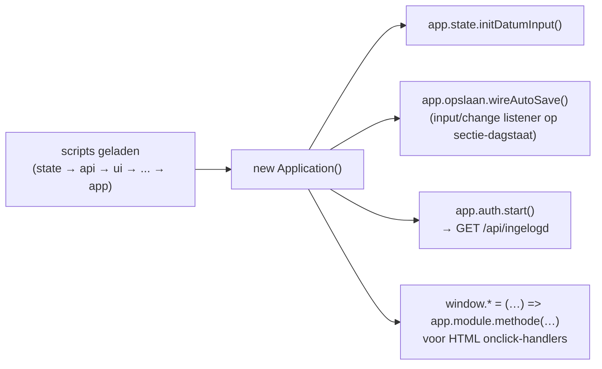

# Frontend

Vanilla JavaScript met ES6-klassen, zonder bundler. Terug naar het
[overzicht](../architecture.md).

---

## 1. Application-container (dependency injection)

`app.js` maakt één `Application`-instantie aan die alle modules als singletons
bevat. Elke module krijgt `app` als enige constructor-argument en roept andere

```mermaid
graph TB
    App["Application (app.js)\n— maakt alle modules\n— exposeert ~25 window.* globals"]

    App --> State["AppState\n(datum, rol, subtabs,\nactieveLimieten, timers)"]
    App --> Api["ApiClient\ncall() · parseNumberValue()"]
    App --> UI["UIManager\ntoonBericht · valideerVeld\nzetInputValue · setAutoSaveStatus"]
    App --> Auth["AuthModule\nstart · verwerkLogin/Logout\nwisselRol"]
    App --> Nav["NavModule\nveranderDatum · begrensSeizoenDatum"]
    App --> Met["MetingenModule\nlaadMetingen · laadActies\nbouwtabel · coordinator-blokken"]
    App --> Verb["VerbruikModule\nladen · opslaan · berekenen"]
    App --> Save["OpslaanModule\nscheduleAutoSave (1.2s debounce)\nverwerkCentraleOpslaan"]
    App --> Log["LogboekModule"]
    App --> Geb["GebruikersModule"]
    App --> DBm["DatabaseModule\nCSV import/export"]
    App --> Trend["TrendModule\nChart.js"]
    App --> Lim["LimietenModule"]
```

modules aan via `this.app.<module>.<methode>()`. De scripts worden sequentieel
als `<script>`-tags geladen (geen `import`/bundler).

---

## 2. Opstarten en globale functies

Alleen de functies die HTML `onclick`-handlers nodig hebben staan op `window`
(bv. `wisselRol`, `veranderDatum`, `voegNieuwBlokToe`, `losActieGroepOp`). Alle
overige communicatie loopt via de container, niet via globals.

---

## 3. Verantwoordelijkheden per module

| Module | Verantwoordelijkheid |
|---|---|
| `AppState` | Eén bron van waarheid voor gedeelde toestand en timers |
| `ApiClient` | `fetch`-wrapper met credentials; `parseNumberValue` (komma→punt) |
| `UIManager` | Statusberichten, veldvalidatie tegen limieten, auto-save-indicator |
| `NavModule` | Datumnavigatie met begrenzing op de seizoengrenzen |
| `AuthModule` | Inloggen/uitloggen, dashboard activeren, rol wisselen |
| `MetingenModule` | Metingen laden/tonen, actie-badges en -indicatoren, coördinator-blokken |
| `VerbruikModule` | Verbruik/verwarming laden, opslaan, dagdelta berekenen |
| `OpslaanModule` | Alle auto-save-orkestratie (centraal + per blok), 1.2 s debounce |
| `LogboekModule` | Logboekblokken voor waterbeheer en coördinatoren |
| `GebruikersModule` | Gebruikersbeheer met auto-save per rij |
| `DatabaseModule` | CSV-import/-export, truncate, herinitialisatie |
| `TrendModule` | Chart.js-grafieken voor metingen en verbruik |
| `LimietenModule` | Limieten laden/renderen/opslaan (auto-save) |

---

## 4. Levering

De HTML wordt server-side samengesteld uit partials (`frontend/partials/`) door
`FrontendController` — geen buildstap. De JS-modules worden als losse
`<script>`-bestanden geserveerd vanuit `frontend/js/`.

> Let op: de frontend blijft bewust vanilla JS (geen TypeScript, geen bundler),
> zodat de applicatie ook achter een eenvoudige statische webserver of Apache
> reverse-proxy kan draaien zonder buildpijplijn.
