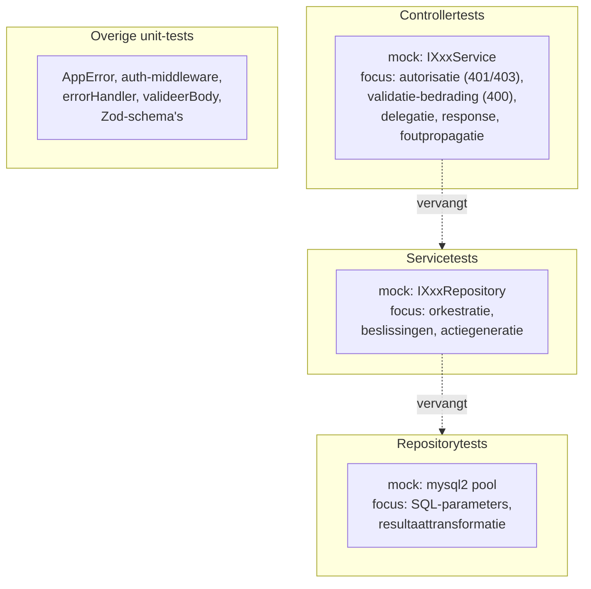

# Testing

Jest + ts-jest + Supertest. De gelaagde architectuur maakt elke laag los
testbaar door de laag eronder te mocken. Terug naar het
[overzicht](../architecture.md).

```
npm run test           # alle tests
npm run test:unit      # unit-tests (geen database nodig)
npm run test:coverage  # met coverage-rapport
```

---

## Teststrategie per laag



Elke laag wordt getest met een mock van de laag eronder:

- **Controllers** — `jest.Mocked<IXxxService>`, gemount via `maakTestApp(router, rol)`
  met een nep-sessie-middleware; aangeroepen met Supertest. Test autorisatie,
  dat ongeldige bodies 400 geven (validatie-bedrading), delegatie naar de service
  en foutpropagatie via de `errorHandler`.
- **Services** — `jest.Mocked<IXxxRepository>`; test de bedrijfslogica
  (bv. keuze peuter/grootbad, auteurberekening, fire-and-forget actiegeneratie).
- **Repositories** — gemockte `mysql2`-pool (`maakMockPool`); test de juiste
  SQL-parameters en de transformatie van rijen naar domeinobjecten.
- **Middleware/validatie** — `errorHandler`, `valideerBody` en de Zod-schema's
  los getest, plus een bedradingstest die bewijst dat `valideerBody` echt aan de
  routes hangt.

---

## Teststructuur

```
test/
  helpers/
    testApp.ts     # maakTestApp(router, rol) + nep-sessie + errorHandler
    mockPool.ts    # maakMockPool() + resultaat()/sqlVan()/paramsVan()
  unit/
    errors.test.ts
    middleware/    # auth, errorHandler
    validation/    # valideer, schemas, wiring
    controllers/   # 1 bestand per controller (mockt de service)
    services/      # 1 bestand per service (mockt de repositories)
    repositories/  # 1 bestand per repository (mockt de pool)
```

De unit-tests draaien volledig zonder database (alle I/O is gemockt), waardoor
ze snel en CI-vriendelijk zijn.

> Integratietests (volledige stack tegen een echte MySQL) staan op de roadmap en
> krijgen een aparte `test:integration`-opzet met een eigen testdatabase.
