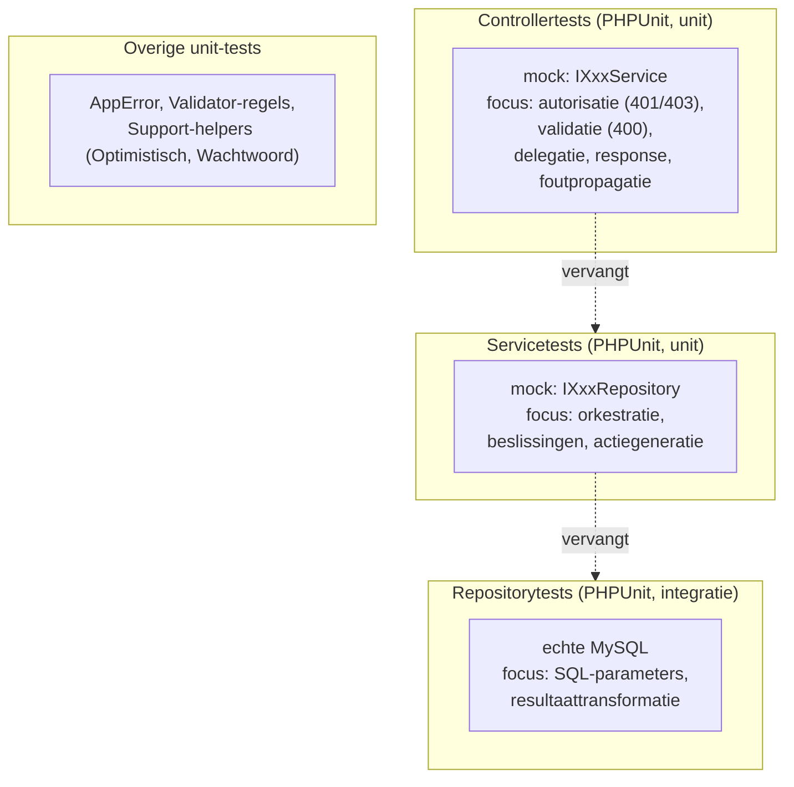

# Testing

Twee onafhankelijke suites: **PHPUnit** voor de PHP-backend en **Jest + jsdom**
(Node) voor de frontend. De gelaagde architectuur maakt elke laag los testbaar door
de laag eronder te mocken. Terug naar het [overzicht](../architecture.md).

```
# Backend (PHPUnit 9.6 — laatste reeks die PHP 8.0 ondersteunt)
docker compose exec web composer test              # unit (geen database)
docker compose exec web composer test:integration  # integratie (echte MySQL)
# of lokaal vanuit backend/: composer test  (DB-env voor de integratietests)

# Frontend (Node, vanuit de project-root)
npm test               # jsdom-tests
npm run test:coverage  # met coverage (frontend/js)
```

Beide suites draaien in CI (GitHub Actions: `php-tests.yml` + `frontend-tests.yml`).

---

## Teststrategie per laag



- **Controllers** — `$this->createMock(IXxxService::class)`, gedispatcht via de
  `AppTestCase`-harness (bouwt de Slim-app + container, met een nep-sessie). Test
  autorisatie, dat ongeldige bodies 400 geven, delegatie naar de service en
  foutpropagatie via de `JsonErrorHandler`.
- **Services** — gemockte `IXxxRepository`; test de bedrijfslogica (bv. keuze
  peuter/grootbad, auteurberekening, fire-and-forget actiegeneratie).
- **Repositories** — getest in de **integratiesuite** tegen een echte MySQL (de
  PDO-SQL is lastig zinvol te mocken); controleert de juiste queries/parameters en de
  transformatie van rijen naar arrays.
- **Validatie/Support** — `Validator` en de `Support`-helpers (`Optimistisch` met al
  zijn conflict-takken, `Wachtwoord`) los unit-getest.

---

## Teststructuur

```
backend/test/
  Support/
    AppTestCase.php          # bouwt de Slim-app + container + nep-sessie (full-stack)
  Integration/
    IntegrationTestCase.php  # echte-DB-basis; opruimen via future-date/itest_/ITest-prefixen
    *RepositoryTest.php       # repositories tegen MySQL + OptimistischTest
  Unit/
    Controllers/             # 1 bestand per controller (mockt de service)
    Services/                # 1 bestand per service (mockt de repositories)
    Validation/              # Validator-regels
    Support/                 # Optimistisch, Wachtwoord
```

De unit-suite draait volledig zonder database (alle I/O gemockt) en is snel +
CI-vriendelijk; de integratiesuite heeft een MySQL nodig. Omdat MySQL geen geneste
transacties kent en de repo's hun eigen transacties openen, ruimt
`IntegrationTestCase` op via afspraken (toekomstige datum 2099 / `itest_`- / `ITest`-
prefixen) i.p.v. één omhullende rollback.

Naast de backend zijn er **frontend jsdom-tests** (`test/unit/frontend/`, in de
project-root onder Node) voor pure helpers én DOM-flows (o.a. de
auto-save/opslaan-paden, volledigheids-markeringen, de versie-round-trip + 409-
conflictafhandeling, de sessie-verloop-afhandeling, de configuratie-autosave en de
alleen-lezen-knoppen). De vanilla-JS-klassen worden via een door de browser
genegeerde `module.exports`-guard importeerbaar gemaakt.

> Richtaantallen (indicatief): PHPUnit **87 unit + 18 integratie**; frontend Jest
> **102** (jsdom).
